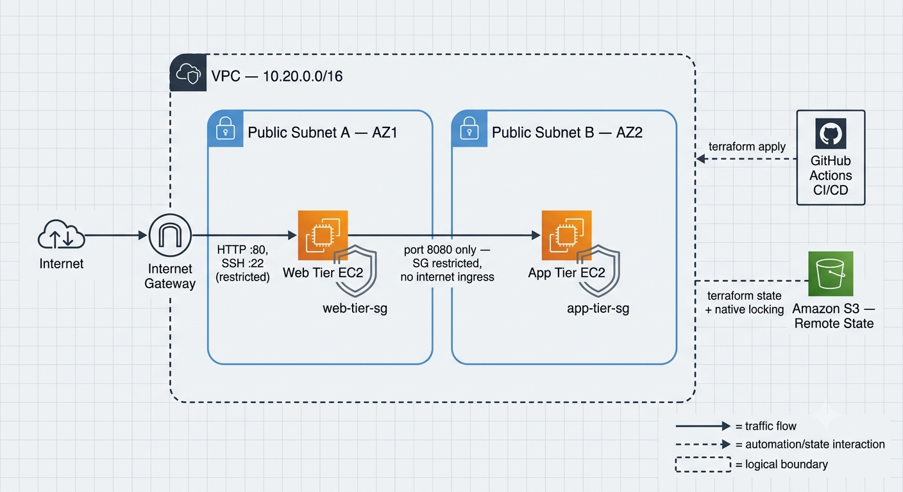
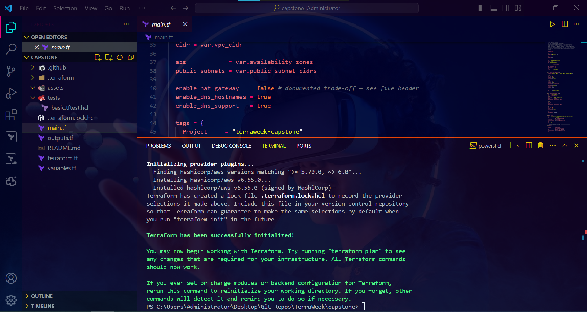
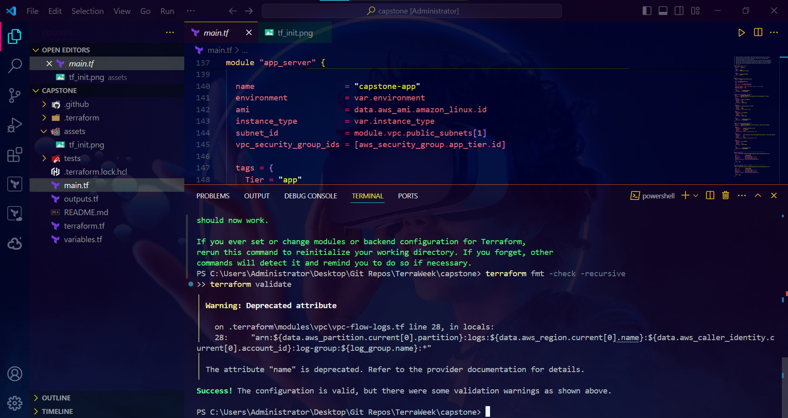
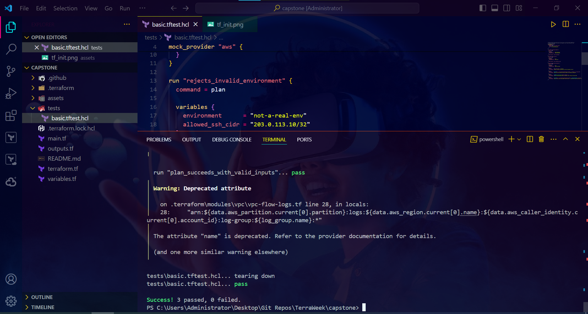
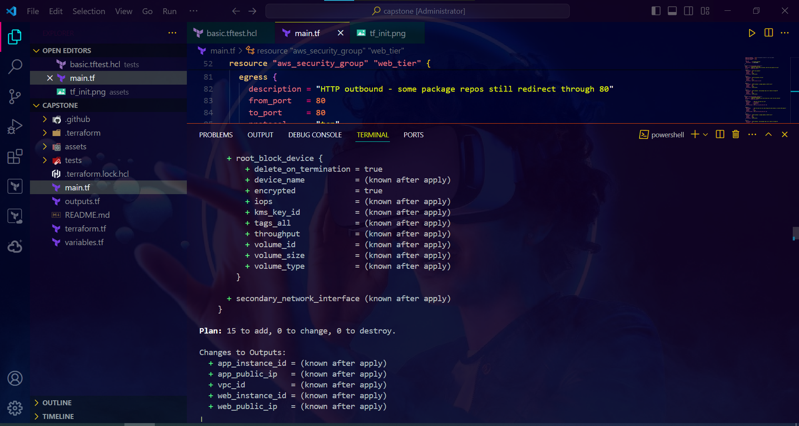
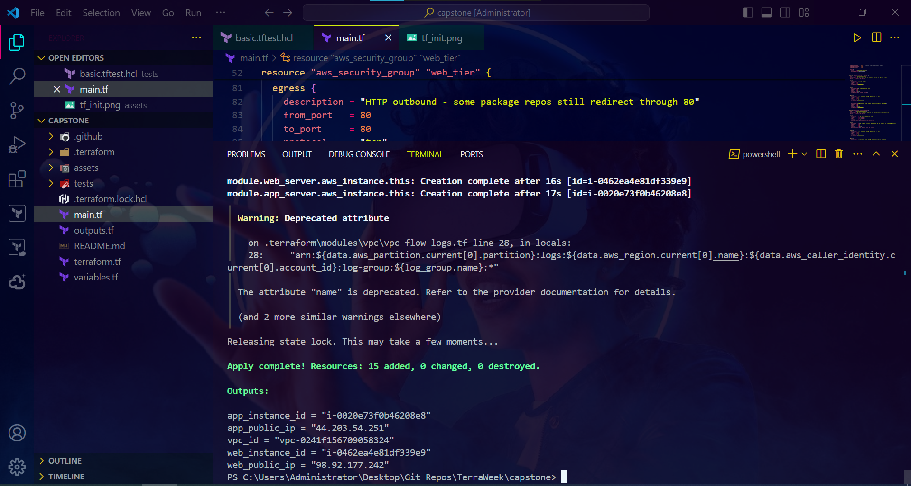
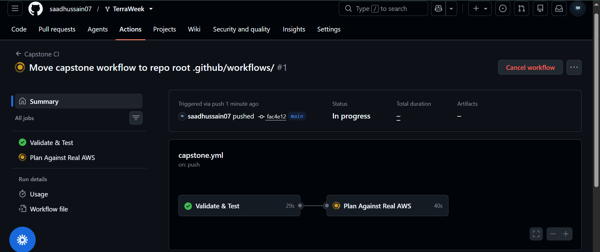
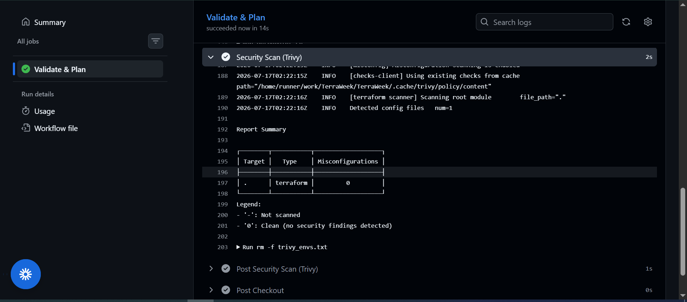
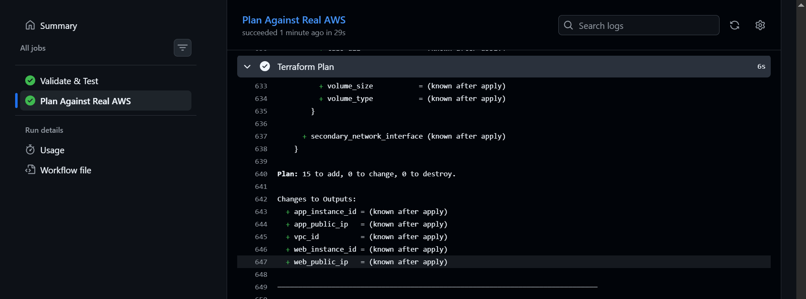
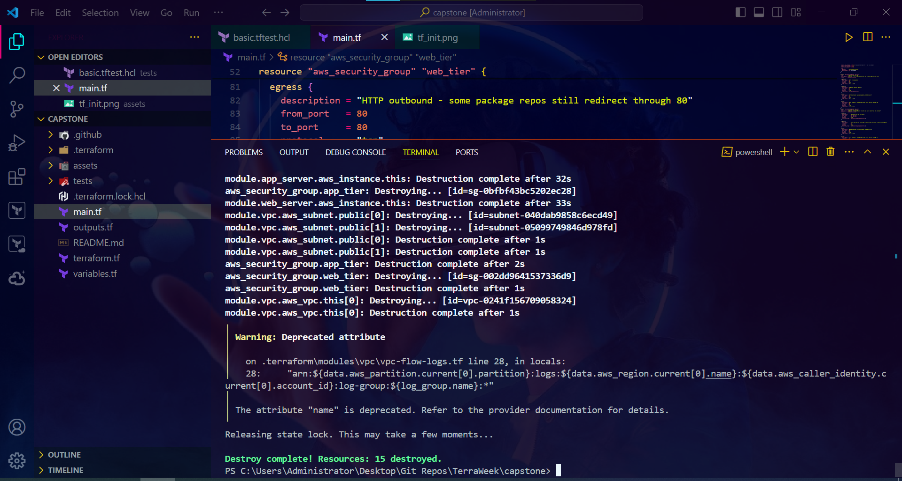

# 🏁 TerraWeek Capstone — 2-Tier Web App on AWS
📅 July 17, 2026

The capstone brought every piece from Days 1–6 together into one real, deployed project:
a custom module and a registry module composed side by side, remote state with native
locking, a test suite that runs without touching AWS, a security scan with documented
trade-offs, a CI/CD pipeline that runs a real plan against live infrastructure, and —
the part that actually proves the design — a live security-boundary test on the deployed
instances themselves.

---

## 🧭 Task 1 — Architecture

A 2-tier web app, public-subnet-only (no NAT gateway, to stay 100% free-tier), with tiering
enforced entirely through security groups rather than network isolation:

```hcl
resource "aws_security_group" "web_tier" {
  description = "Web tier - HTTP from the internet, SSH from the operator IP only"
  # 80 from 0.0.0.0/0, 22 from var.allowed_ssh_cidr only
}

resource "aws_security_group" "app_tier" {
  description = "App tier - reachable only from the web tier, never from the internet"
  ingress {
    from_port       = var.app_port
    security_groups = [aws_security_group.web_tier.id]   # no cidr_blocks at all
  }
}
```

The app tier's ingress has **no `cidr_blocks` entry whatsoever** — it only trusts the web
tier's security group ID. That single design choice is what the live test at the bottom of
this document actually proves.



---

## 🧩 Task 2 — Custom Module + Registry Module

Reused the exact same `ec2_instance` module from Day 5/6 (`git::...terraform-ec2-module.git?ref=v1.1.0`,
already hardened with IMDSv2 + encrypted root volume) — called **twice**, once per tier:

```hcl
module "web_server" {
  source = "git::https://github.com/saadhussain07/terraform-ec2-module.git?ref=v1.1.0"
  name   = "capstone-web"
  ami    = data.aws_ami.amazon_linux.id
  subnet_id               = module.vpc.public_subnets[0]
  vpc_security_group_ids  = [aws_security_group.web_tier.id]
}

module "app_server" {
  source = "git::https://github.com/saadhussain07/terraform-ec2-module.git?ref=v1.1.0"
  name   = "capstone-app"
  ami    = data.aws_ami.amazon_linux.id
  subnet_id               = module.vpc.public_subnets[1]
  vpc_security_group_ids  = [aws_security_group.app_tier.id]
}
```

Paired with the registry VPC module (`terraform-aws-modules/vpc/aws ~> 5.0`) for the network
foundation — same module used in Day 5, this time with `map_public_ip_on_launch = true`
(a real bug caught during planning — the default is `false`, which would have meant neither
instance got a public IP at all).



---

## 🔒 Task 3 — Remote State, Native Locking

Same S3 bucket as Day 4, new state key so it doesn't collide with the daily examples:

```hcl
backend "s3" {
  bucket       = "terraweek-2026-state-bucket-by-saadhussain"
  key          = "capstone/terraform.tfstate"
  region       = "us-east-1"
  encrypt      = true
  use_lockfile = true
}
```

---

## 🧾 Task 4 — Variables & Outputs

`allowed_ssh_cidr` has no default and a validation rule that explicitly rejects `0.0.0.0/0`
— the plan simply fails if you try to leave SSH open to the world:

```hcl
variable "allowed_ssh_cidr" {
  type = string
  validation {
    condition     = var.allowed_ssh_cidr != "0.0.0.0/0"
    error_message = "allowed_ssh_cidr must not be 0.0.0.0/0 - restrict SSH to your own IP."
  }
}
```

Outputs surface exactly what you need after apply — both public IPs and both instance IDs,
nothing extraneous.



---

## ✅ Task 5 — Quality Gates: fmt, validate, test

Native `terraform test`, using `mock_provider "aws" {}` so the whole suite runs with **zero
AWS credentials** — same principle as Day 6, applied to real resource types instead of
`random_pet` this time:

```hcl
mock_provider "aws" {
  override_data {
    target = data.aws_ami.amazon_linux
    values = { id = "ami-0123456789abcdef0" }
  }
}

run "rejects_invalid_environment" {
  command = plan
  variables { environment = "not-a-real-env" }
  expect_failures = [var.environment]
}

run "rejects_open_ssh_cidr" {
  command = plan
  variables { allowed_ssh_cidr = "0.0.0.0/0" }
  expect_failures = [var.allowed_ssh_cidr]
}

run "plan_succeeds_with_valid_inputs" {
  command = plan
  assert {
    condition = !anytrue([for r in aws_security_group.app_tier.ingress : contains(coalesce(r.cidr_blocks, []), "0.0.0.0/0")])
    error_message = "app tier must never allow ingress from 0.0.0.0/0"
  }
}
```

⚠️ Two real bugs surfaced and got fixed here, not just theoretical test-writing:
- The mocked `aws_ami` data source returned a fake ID that failed the module's own AMI
  format validation — fixed with `override_data`.
- `contains()` on `r.cidr_blocks` crashed on the app tier's rules, since those use
  `security_groups` instead and `cidr_blocks` comes back `null` — fixed with `coalesce()`.



---

## 🛡️ Task 6 — Security Scan (Trivy)

Two categories of finding, handled two different ways:

**Fixed:** egress was originally "all ports, all protocols, 0.0.0.0/0" — narrowed to just
80/443 (HTTPS + HTTP for package updates), which is the actual security-relevant part of
the finding.

**Documented, not fixed** (same discipline as Day 6's VPC Flow Logs call):
- **AWS-0104 (CRITICAL)** — egress destination is still `0.0.0.0/0`. Pinning it further
  would mean hardcoding Amazon's package-repo IP ranges, which shift over time and aren't
  meant to be hand-maintained. The port-scope narrowing already done is the meaningful fix;
  ingress remains the enforced boundary.
- **AWS-0178 (MEDIUM)** — VPC Flow Logs disabled on the registry VPC module, same trade-off
  as Day 6, out of scope for this exercise.

---

## 🚀 Task 7 — Deploy & Verify

```bash
terraform plan -var="allowed_ssh_cidr=YOUR_IP/32"
```



```bash
terraform apply -var="allowed_ssh_cidr=YOUR_IP/32"
```

```
Apply complete! Resources: 15 added, 0 changed, 0 destroyed.

web_public_ip = "98.92.177.242"
app_public_ip = "44.203.54.251"
```



**The real test — does the security design actually hold?**

```bash
curl.exe http://98.92.177.242
# curl: (7) Failed to connect... Could not connect to server (fast refusal, ~3.4s)

curl.exe --connect-timeout 5 http://44.203.54.251:8080
# curl: (28) Connection timed out after 5004 milliseconds
```

These two failures look similar but mean completely different things. The web tier's fast
refusal is a TCP RST — the network path is open, nothing's listening (no app was deployed,
out of scope here). The app tier's timeout is silence — the packet never got a response at
all, because the security group dropped it before it ever reached the instance. That
contrast is the actual proof that `security_groups = [aws_security_group.web_tier.id]`
with no `cidr_blocks` genuinely isolates the app tier, not just on paper.


---

## 🔄 Task 8 — CI/CD Pipeline

⚠️ Hit a real gotcha here worth documenting: GitHub Actions only scans workflow files at
`<repo-root>/.github/workflows/`, not a subfolder's `.github/`. The workflow was first
placed at `capstone/.github/workflows/capstone.yml` and silently never ran — every push
was only triggering Day 6's pre-existing root-level workflow instead. Moved it to the
actual repo root and it started working immediately.

Two jobs: `Validate & Test` (fmt, validate, test, Trivy — zero AWS credentials) and
`Plan Against Real AWS` (needs `AWS_ACCESS_KEY_ID` / `AWS_SECRET_ACCESS_KEY` /
`ALLOWED_SSH_CIDR` repo secrets, runs a real `terraform plan` against the live S3 backend).





The CI plan matched the local plan exactly — `15 to add, 0 to change, 0 to destroy` in both
places — real local/CI parity, not just "it ran."

---

## 🧹 Task 9 — Clean Teardown

```bash
terraform destroy -var="allowed_ssh_cidr=YOUR_IP/32"
```

```
Destroy complete! Resources: 15 destroyed.
```



---

## 🎯 Requirements checklist

| # | Requirement | Status |
|---|---|---|
| 1 | Custom module + registry module | ✅ |
| 2 | Remote state, native S3 locking | ✅ |
| 3 | Variables + sensible outputs | ✅ |
| 4 | fmt, validate, security scan, ≥1 test | ✅ |
| 5 | GitHub Actions workflow wired up | ✅ |
| 6 | README with architecture diagram + run instructions | ✅ |
| 7 | Clean `terraform destroy` | ✅ |

All seven, fully verified against real AWS — not just planned.

---

This project is less about the resource count and more about the two curl commands near
the bottom: a security group either genuinely isolates a tier or it doesn't, and the only
way to know is to actually try to break in and watch it fail correctly.

#TrainWithShubham #TerraWeekChallenge