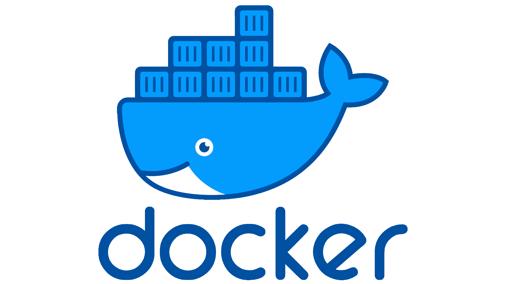
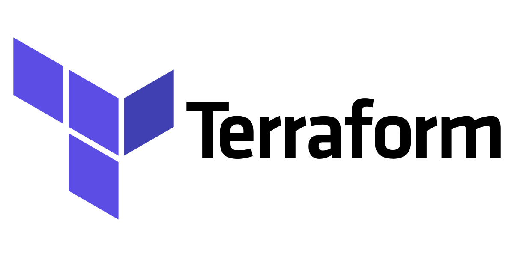
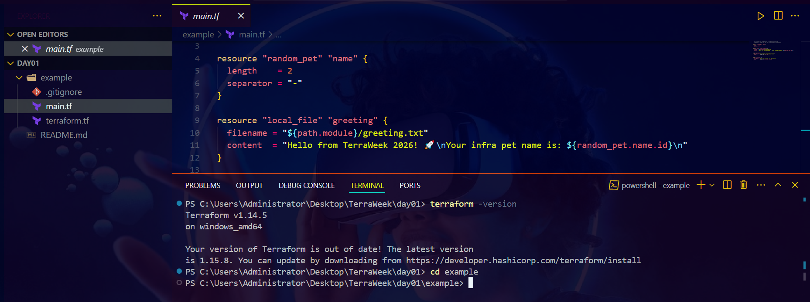
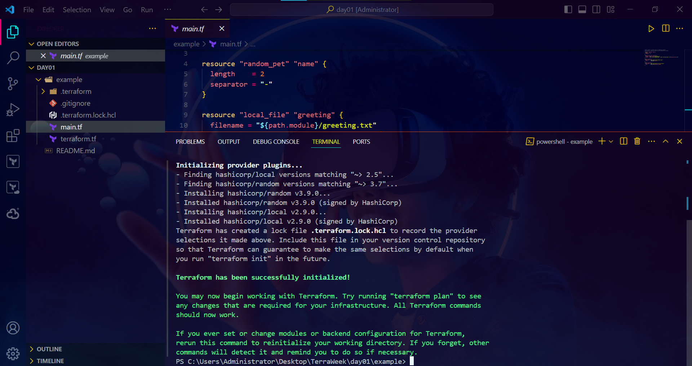
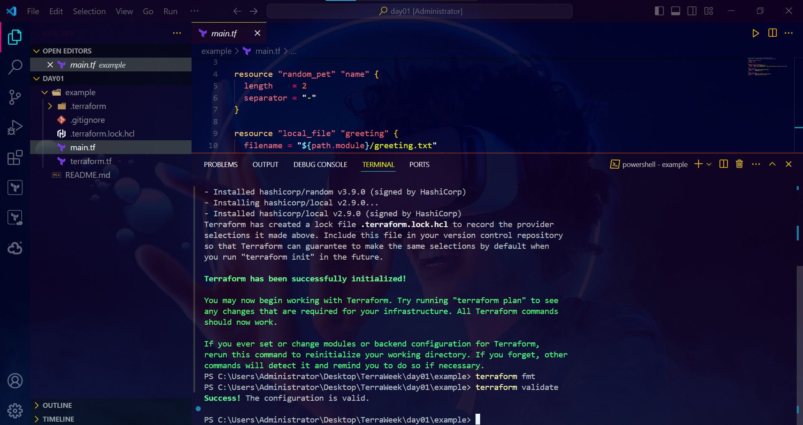
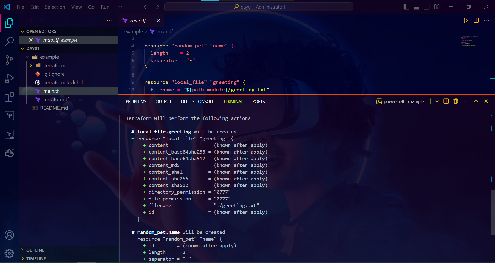
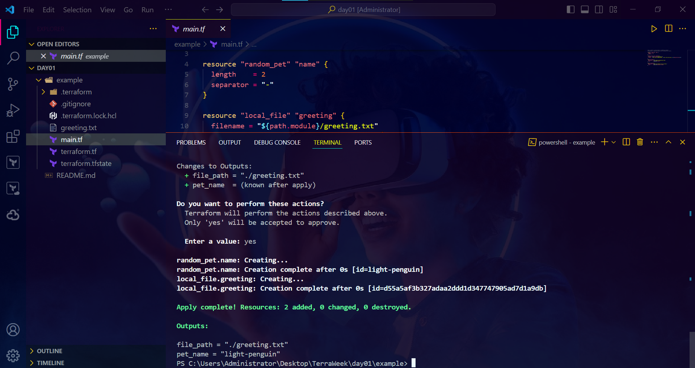
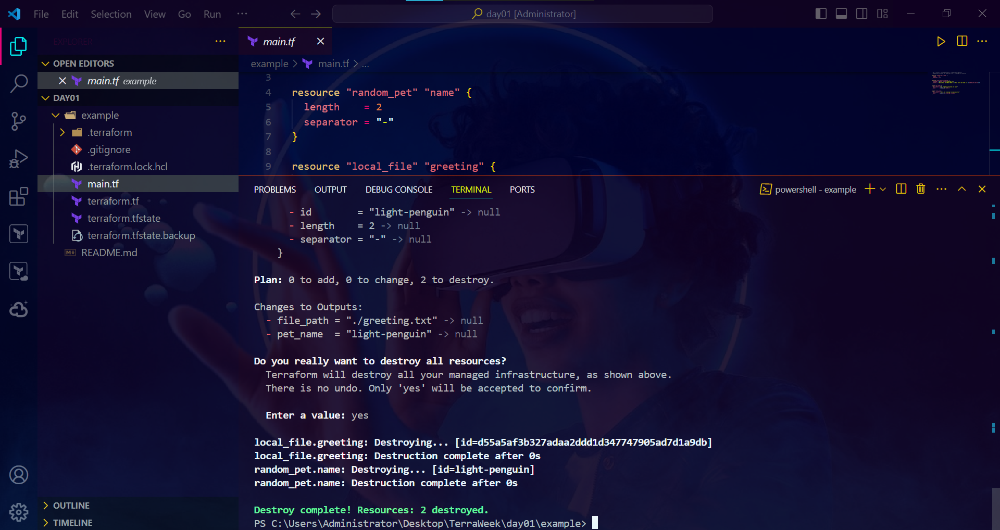

# TerraWeek Day 1 — Introduction to IaC & Terraform Basics

Date: Sunday, 12th July 2026

## Task 1 — IaC & Terraform, short answers

**What is IaC, and what problem does it solve?**

Infrastructure as Code means defining your servers, networks, and cloud resources in text files instead of clicking through a console. The problem it solves is repeatability — clicking around AWS console works fine once, but the moment you need to rebuild that same environment for staging, or after someone accidentally deletes something, you're relying on memory or outdated docs. With IaC, the config file is the documentation, and it's version-controlled, reviewable, and repeatable.

**What is Terraform, and why is it popular?**

Terraform is a tool that reads declarative config files written in HCL and figures out what API calls to make to create, update, or delete infrastructure to match what you described. It's popular mainly because it's provider-agnostic — the same workflow works whether you're on AWS, Azure, GCP, or Docker — and because the provider ecosystem is huge, so almost anything you want to automate already has a Terraform provider.

<p align="center">
  
  
  
  
  
</p>

**Terraform vs alternatives**

| Tool | One-liner |
|---|---|
| OpenTofu | Community-governed fork of Terraform, near-identical syntax, exists because of HashiCorp's BSL license change |
| Pulumi | Same idea as Terraform but config is written in real code (Python, TypeScript, Go) instead of HCL |
| CloudFormation | AWS-only, no multi-cloud support, but tightly integrated with AWS from day one |
| Ansible | Primarily a configuration management tool for existing servers, not a dedicated provisioning tool like Terraform |

## Task 2 — Install Terraform

Installed Terraform 1.15 via the official install guide and verified with `terraform version` and `terraform -help`.



Also installed the HashiCorp Terraform extension in VS Code for syntax highlighting and autocomplete.

## Task 3 — Six Terraform terms

1. **Provider** — the plugin Terraform uses to talk to a specific platform. Example: the `aws` provider lets you create EC2 instances; this challenge's example uses `random` and `local` instead.
2. **Resource** — an actual thing Terraform creates and manages. In the example config, `local_file.greeting` is a resource.
3. **State** — Terraform's memory of what it has created, stored in `terraform.tfstate`. It's how Terraform knows the difference between "create this" and "this already exists."
4. **Plan** — a dry run. `terraform plan` shows exactly what will change before anything actually happens.
5. **HCL** — HashiCorp Configuration Language, the syntax every `.tf` file is written in.
6. **Module** — a folder of `.tf` files that can be reused across projects instead of rewriting the same setup repeatedly.

## Task 4 — First Terraform config

Used the `local` and `random` providers so the whole exercise runs with no cloud account and no cost.

```hcl
resource "random_pet" "greeting_name" {
  length = 2
}

resource "local_file" "greeting" {
  filename = "${path.module}/greeting.txt"
  content  = "Hello, ${random_pet.greeting_name.id}! This file was created by Terraform on Day 1 of TerraWeek."
}
```

**terraform init** — downloads the `local` and `random` providers and sets up the working directory.



**terraform validate** — checks the config for syntax errors.



**terraform plan** — previews the two resources that will be created.



**terraform apply** — creates `greeting.txt` with a randomly generated name inside it.



**terraform destroy** — tears everything back down, leaving no trace and no cost.



## Bonus

`.terraform.lock.hcl` records the exact provider versions Terraform resolved on `init`, so anyone else running `init` later gets the same versions instead of whatever happens to be newest at the time.

---
#TrainWithShubham #TerraWeekChallenge