# TerraWeek Day 2 — HCL Deep Dive: Variables, Types & Expressions

Date: Monday, 13th July 2026

## Task 1 — HCL syntax, in plain terms

**Anatomy of a block:**
```
block_type "label_one" "label_two" {
  argument = value
}
```
`resource "docker_container" "web" { ... }` — `resource` is the block type, `"docker_container"` and `"web"` are labels (type and local name), and everything inside `{}` is arguments.

**Argument vs block:** an argument is a single `key = value` line (like `name = "nginx"`). A block is a nested structure that can itself contain more arguments or blocks — like the `validation { }` block inside a variable, or the `ports { }` and `dynamic "labels" { }` blocks inside the docker container resource. Arguments assign a value; blocks configure a nested structure.

**Expressions:**
- String interpolation: `"${local.name_prefix}-${var.container_name}"` — mixes literal text with references inside a string.
- References: `docker_image.nginx.image_id` — pointing at another resource's exported attribute.
- Operators: standard `==`, `!=`, `&&`, `||`, plus the ternary `condition ? true_val : false_val`.

## Task 2 — Variables, types & validation

`variables.tf` covers every major type: primitives (`container_name`, `external_port`, `environment`), a `sensitive = true` value, collections (`image_tag`, `extra_labels` as a map, `names` as a list), and a structural `object` type (`resource_profile`) with an `optional()` attribute.

```hcl
variable "external_port" {
  description = "Host port to expose the container on."
  type        = number
  default     = 8080

  validation {
    condition     = var.external_port > 1024 && var.external_port < 65535
    error_message = "external_port must be between 1025 and 65534."
  }
}
```

**Setup — install, init, format, validate:**

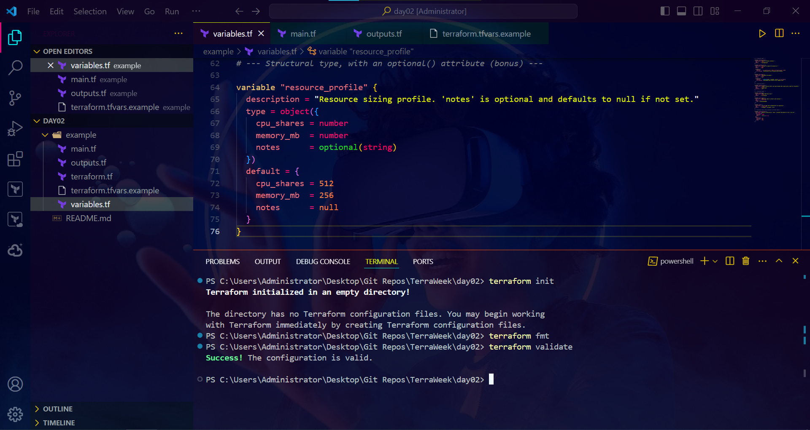

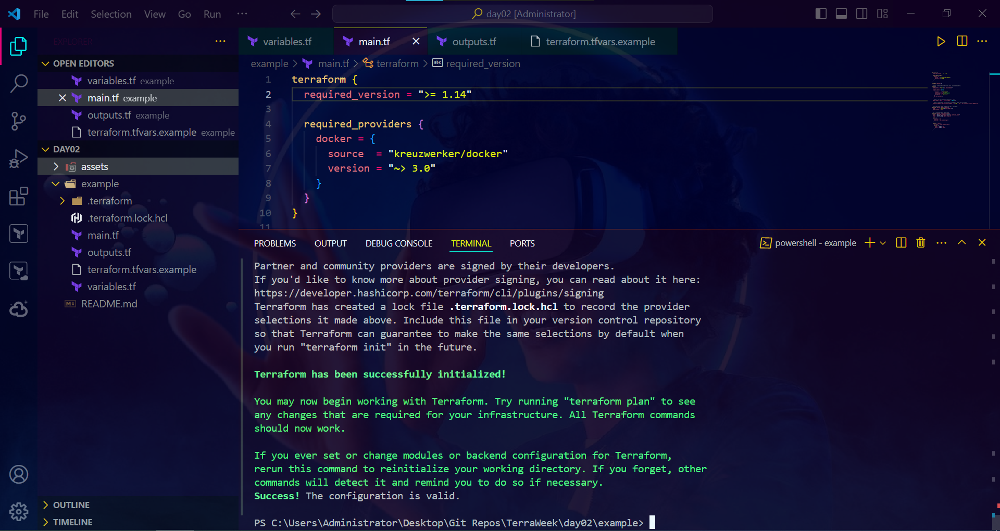

## Task 3 — Locals, outputs & functions

`locals` computes `name_prefix` (string interpolation) and `common_labels` (merging default tags with `var.extra_labels` via `merge()`). Outputs expose the container's name, URL, and computed values so I don't have to dig through `docker ps` to find them.

Tried the built-in functions live in `terraform console`:


`upper()` uppercases a string, `merge()` combines two maps, `join()` builds a hyphen-separated string from a list, `length()` counts list items, and `lookup()` pulls a value out of a map by key with a default fallback.

## Task 4 — Docker provider, driven by variables

Used the `kreuzwerker/docker` provider to pull Nginx and run a container, with the image tag, port, and labels all coming from variables — no cloud account, no cost.

```hcl
resource "docker_container" "web" {
  name  = "${local.name_prefix}-${var.container_name}"
  image = docker_image.nginx.image_id

  ports {
    internal = 80
    external = var.external_port
  }

  dynamic "labels" {
    for_each = local.common_labels
    content {
      label = labels.key
      value = labels.value
    }
  }
}
```

**terraform plan:**

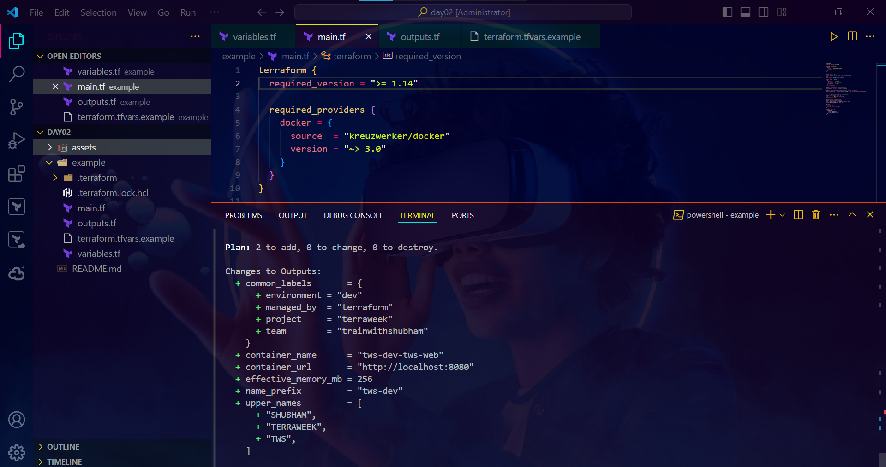

**terraform apply — creating:**

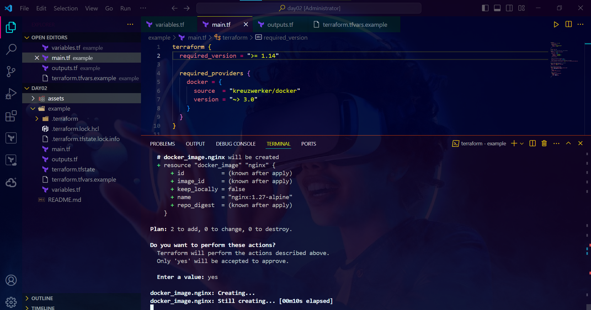

**terraform apply — complete, port 8080:**

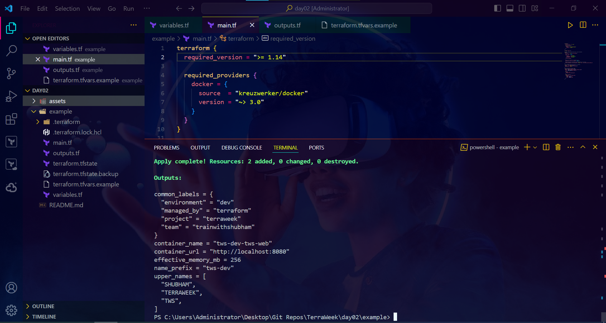

**Verified in the browser:**

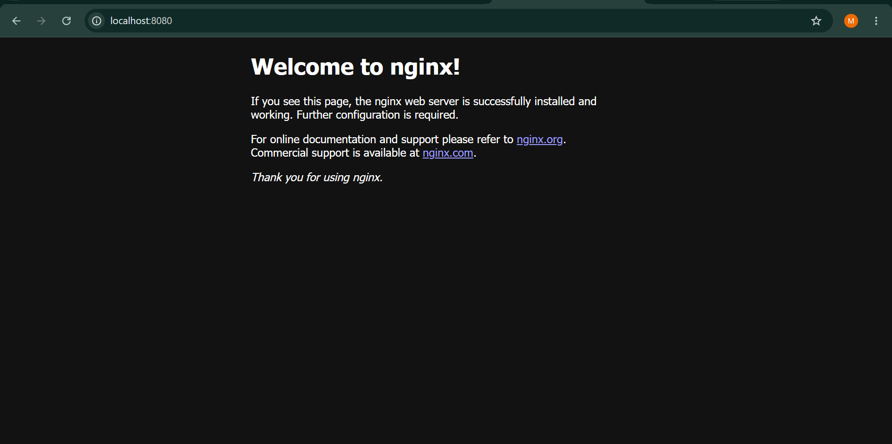

**terraform output:**

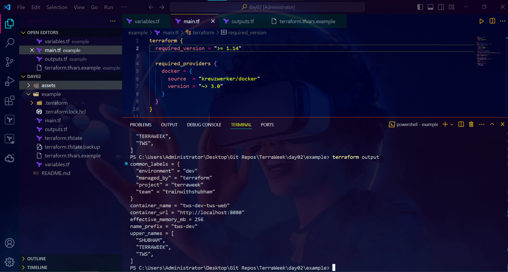

## Variable precedence, demonstrated

Ran the same config with `terraform.tfvars` (default port 8080) and a `prod.auto.tfvars` overriding it to 9090, then overrode everything again with `-var 'external_port=7000'` on the command line — proving `-var` wins over everything else in the chain:

```
-var / -var-file  ▶  *.auto.tfvars  ▶  terraform.tfvars  ▶  TF_VAR_ env vars  ▶  default
```

**Plan with `-var` override, showing port 7000:**

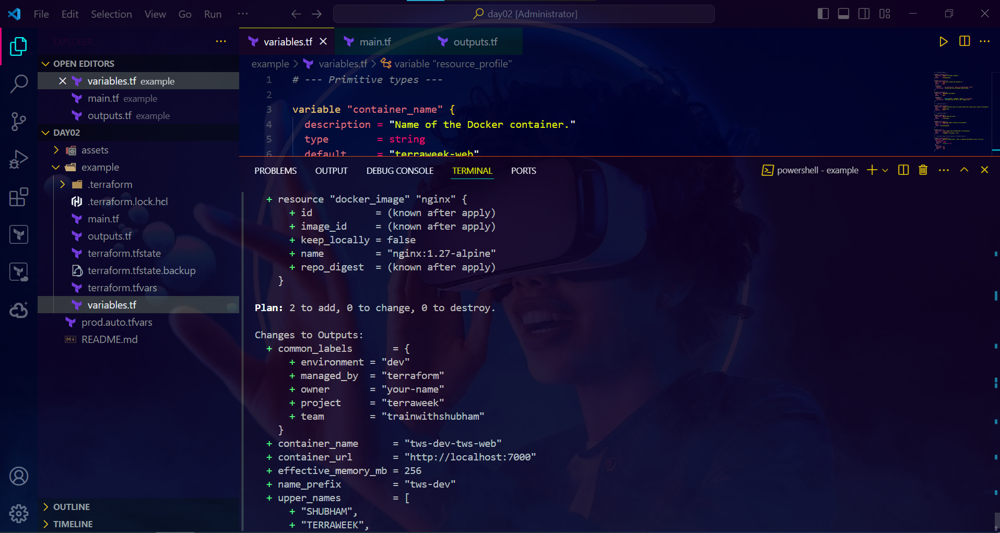

**Apply complete with `-var`, container now on port 7000:**

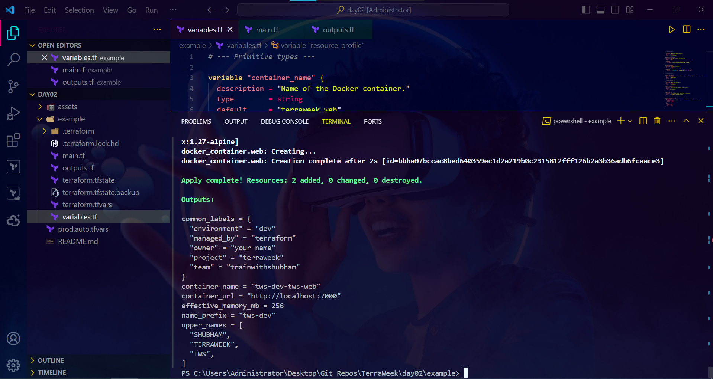

**Verified in the browser at the new port:**

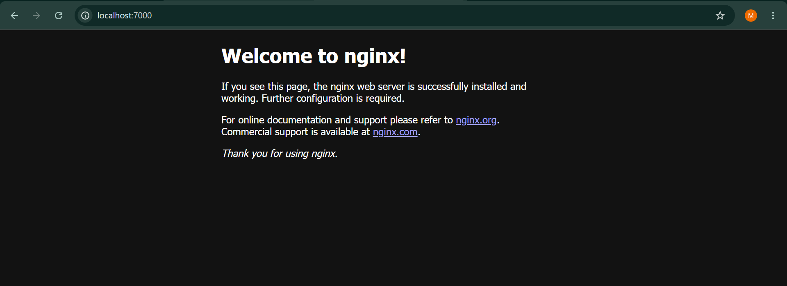

## Cleanup

```
terraform destroy
```

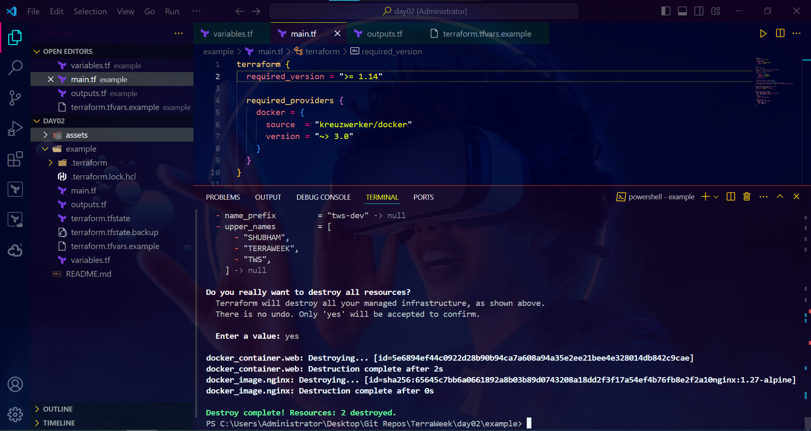

## Bonus

- **For expression:** `local.upper_names = [for n in var.names : upper(n)]` — transforms every item in the `names` list to uppercase.
- **Conditional expression:** `local.effective_memory_mb = var.environment == "prod" ? 512 : var.resource_profile.memory_mb` — picks a memory value based on environment.
- **`optional()` attribute:** the `resource_profile` object type marks `notes` as optional, so it defaults to `null` if not explicitly set.

---
#TrainWithShubham #TerraWeekChallenge
