# TerraWeek Day 3 — Providers, Resources & Your First Cloud Infra

Date: Tuesday, 14th July 2026

## Task 1 — Providers & version pinning

```hcl
terraform {
  required_version = ">= 1.10"

  required_providers {
    aws = {
      source  = "hashicorp/aws"
      version = "~> 6.0"
    }
    random = {
      source  = "hashicorp/random"
      version = "~> 3.6"
    }
  }
}
```

**Why version pinning matters:** without it, `terraform init` can pull down whatever the latest provider version happens to be on that day — which can silently introduce breaking changes months after the config was written. Pinning guarantees the same config behaves the same way regardless of when or where it's run.

**What `~>` does:** the pessimistic constraint operator. `~> 6.0` means "allow any 6.x version (6.1, 6.2, 6.99...) but never jump to 7.0 automatically." You get bug fixes and minor updates without risking a major breaking change sneaking in on a routine `init`.

**Bonus — second provider alias:**

```hcl
provider "aws" {
  alias  = "dr"
  region = var.dr_region
  ...
}
```

Use case: when a single Terraform config needs resources in more than one region at once — for example, a primary stack in `us-east-1` plus an S3 bucket replicated to `us-west-2` for disaster recovery, or a CloudFront distribution's ACM certificate, which AWS requires to live in `us-east-1` no matter where the rest of the infrastructure sits.

## Task 2 — Resources vs data sources

- **Resource** (creates/manages something): `aws_vpc.main`, `aws_instance.web`, `aws_s3_bucket.protected_demo` — Terraform owns the full lifecycle of these, create through destroy.
- **Data source** (only reads): `data.aws_ami.al2023` and `data.aws_availability_zones.available` — these read information that already exists outside Terraform's control (AWS's own published AMIs, the region's AZ list) so the config can reference it without hardcoding IDs that change over time.

## Task 3 — The cloud stack

Built the full network + compute stack: VPC, public subnet, internet gateway, route table, security group (port 80 open), and an EC2 instance that installs Nginx via `user_data` on boot — no SSH key pair needed.

**Setup — init, fmt, validate:**

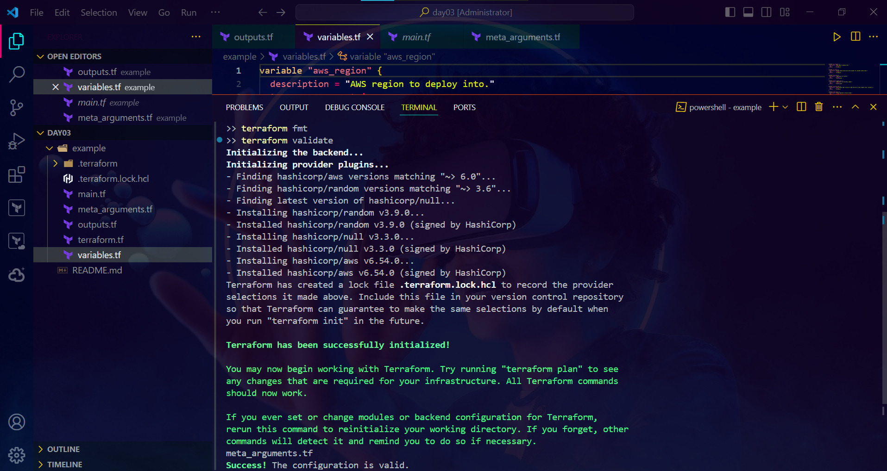

**terraform plan:**

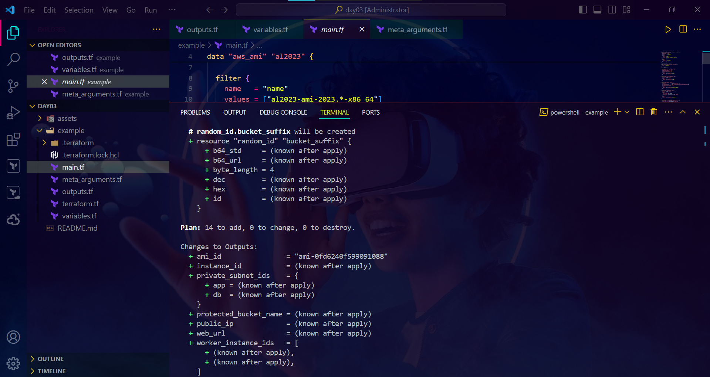

**terraform apply — complete:**

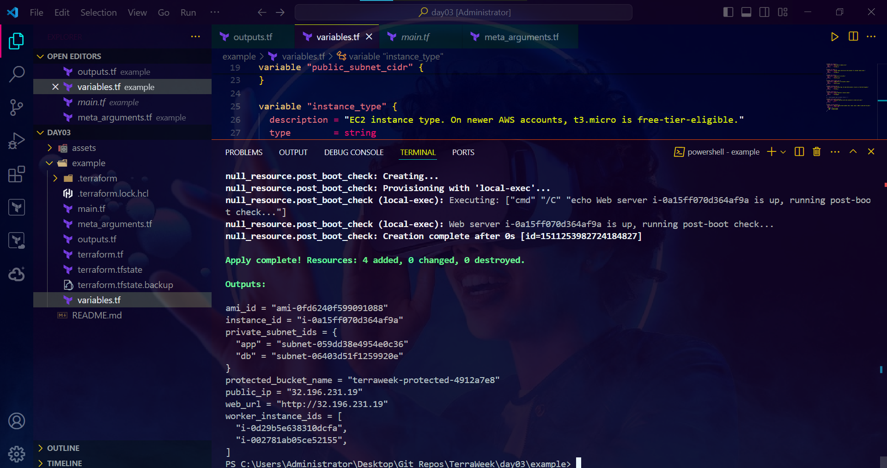

**terraform state list:**

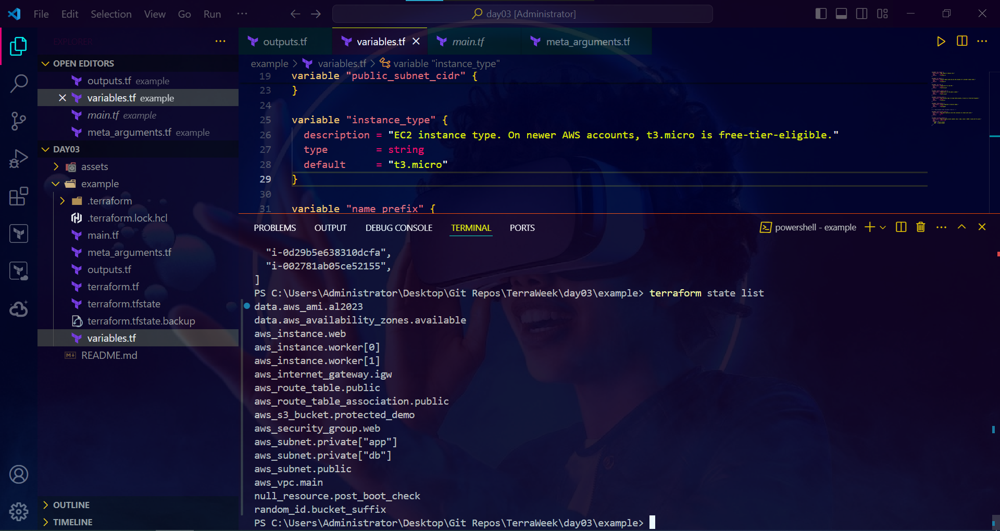

**terraform output:**

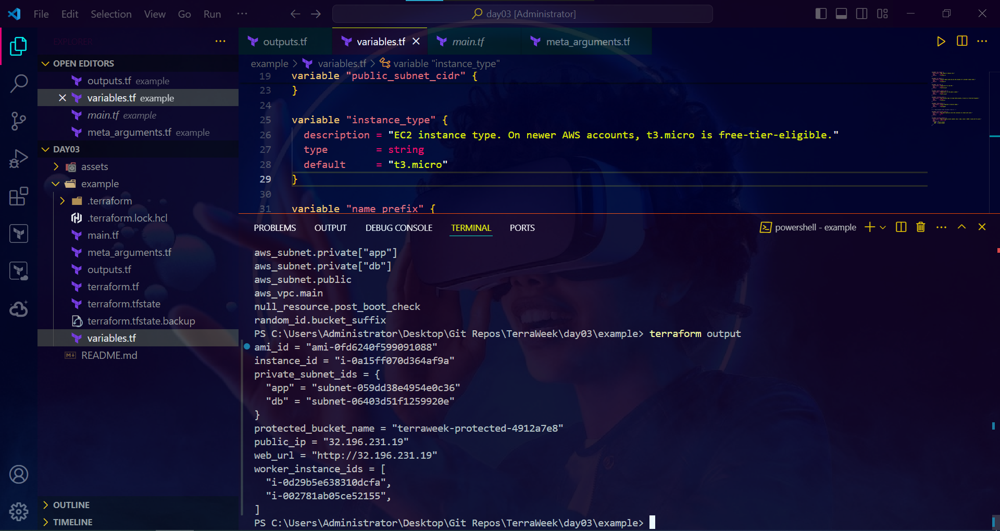

**Verified in the browser (public IP from the output):**

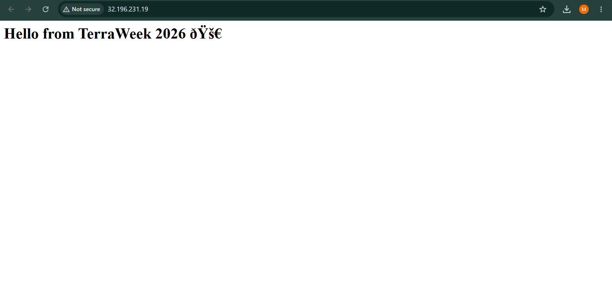

**Confirmed in the AWS Console:**

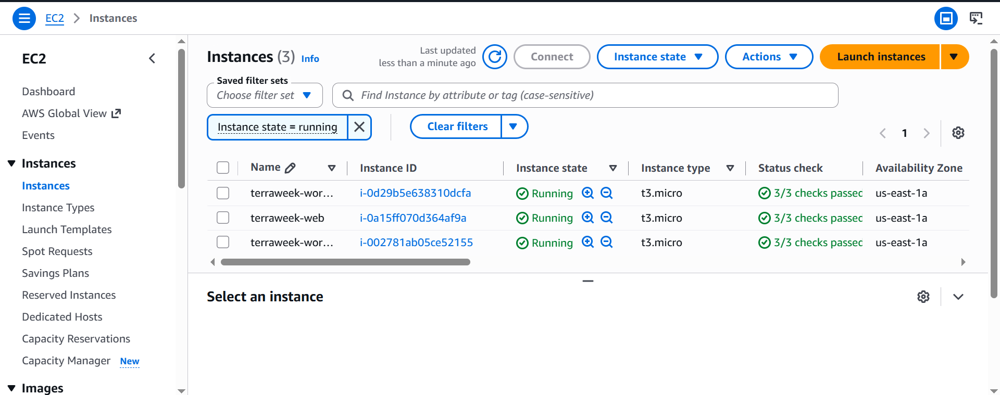

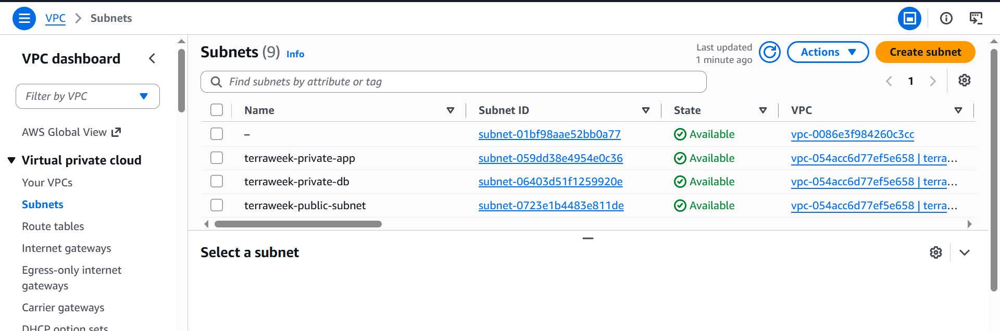

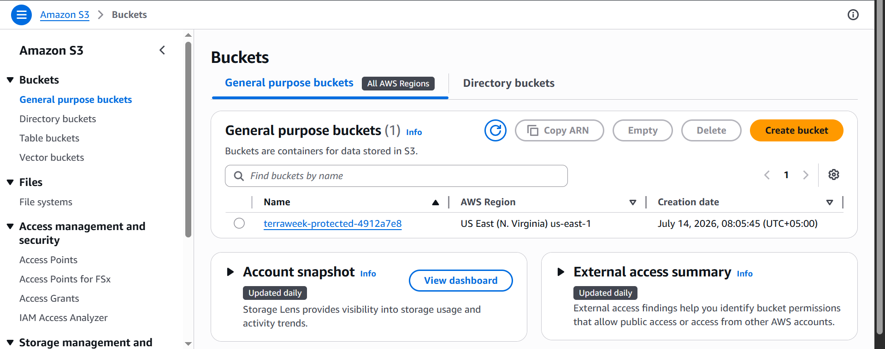

## Task 4 — Meta-arguments in action

- **`for_each`** — two named private subnets (`app`, `db`) built from a map, so each one has a stable identity. Deleting one later won't reshuffle the other, unlike an indexed list.
```hcl
resource "aws_subnet" "private" {
  for_each          = var.private_subnets
  cidr_block        = each.value
  ...
}
```
- **`count`** — two identical, interchangeable "worker" EC2 instances. They don't need individual names or identities, so `count` is the simpler fit here.
```hcl
resource "aws_instance" "worker" {
  count = var.extra_worker_count
  ...
}
```
- **`depends_on`** — Terraform infers most ordering from attribute references automatically, but a `null_resource` that doesn't reference any attribute of the web server still needed to run only after it existed, so the dependency had to be stated explicitly.
```hcl
resource "null_resource" "post_boot_check" {
  depends_on = [aws_instance.web]
  ...
}
```
- **`lifecycle`** — three patterns tried:
  - `create_before_destroy = true` on the web instance, so a replacement gets created before the old one is torn down (avoids downtime).
  - `ignore_changes = [tags["LastModified"]]`, so Terraform stops flagging drift on a tag that's expected to change outside of Terraform.
  - `prevent_destroy = true` on a small S3 bucket, to block accidental deletion.

## Task 5 — Update & destroy

Changed `instance_type` from `t3.micro` to `t3.small` and ran `plan` (without applying) to see the diff:

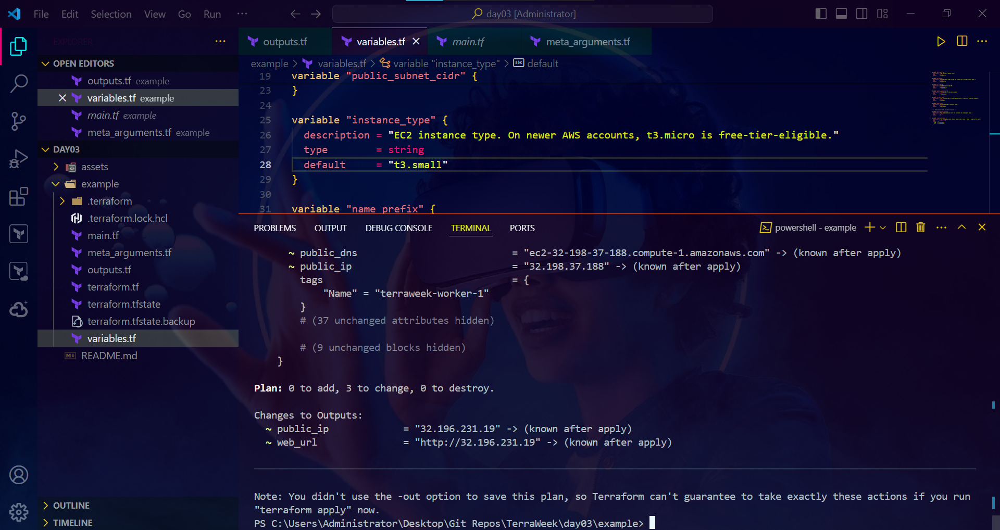

Changing `instance_type` **forces a replacement** — AWS can't resize a running instance's type in-place through this API path, so Terraform has to destroy and recreate it. That's different from something like a tag change, which AWS can update in-place with no replacement needed. Reverted back to `t3.micro` afterward since that's what's actually deployed and free-tier-eligible on this account.

**Cleanup — `terraform destroy`:**

Since `aws_s3_bucket.protected_demo` has `prevent_destroy = true`, that protection was lifted first (flipped to `false`) so destroy could complete cleanly:

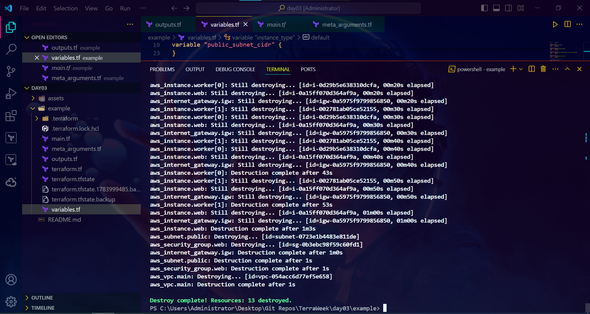

## Notes on the AWS Free Tier

One thing worth flagging for anyone following along: on AWS accounts created after July 15, 2025, `t2.micro` is no longer free-tier-eligible in most regions — `t3.micro` is the type that's actually covered under the new credit-based Free Plan. Worth checking with `aws ec2 describe-instance-types --filters "Name=free-tier-eligible,Values=true"` before picking an instance type if you hit the same `InvalidParameterCombination` error.

---
#TrainWithShubham #TerraWeekChallenge
