# 🗄️ TerraWeek Day 4 — Terraform State & Remote Backends (Native Locking)

📅 Date: Wednesday, 15th July 2026

## 📝 Task 1 — Why state matters

**What is `terraform.tfstate` and what does it store?** A JSON file that records everything Terraform manages — real-world resource IDs, all their attributes, and the dependency graph between them. It's Terraform's only record of what actually exists, mapped back to the resource blocks in code.

**Why never edit it by hand or commit it to Git:** the state can contain **secrets in plaintext** — database passwords, API keys, anything that ends up as a resource attribute. Committing it to Git exposes those permanently in history. Hand-editing it risks a mismatch between what the file says exists and what's actually in the cloud, which then causes Terraform to make wrong decisions on the next apply.

**State drift:** ⚠️ when real infrastructure changes outside of Terraform (someone edits a setting in the console, or a resource gets deleted manually) without Terraform's state being updated. `terraform plan` compares state against the real infrastructure and shows the difference; `terraform refresh` (now folded into `plan`/`apply` by default) re-syncs state to match reality without changing anything.

**Why state is sensitive:** 🔒 because it's a plaintext record of resource attributes, which can include credentials, connection strings, and other secrets depending on what resources are managed — hence encryption at rest and restricted access are mandatory for any remote backend.

## 🔍 Task 2 — exploring state commands

Practiced against `backend_demo`'s local state before migrating to S3:

```
terraform state list
terraform state show aws_s3_bucket.app_data
terraform state mv random_pet.demo random_pet.app_name
terraform state rm local_file.scratch
```

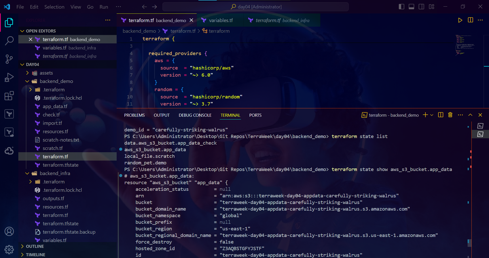

- **`state list`** — lists every resource address Terraform currently manages.
- **`state show <address>`** — prints every attribute of one specific resource, straight from state.
- **`state mv`** — renames/moves a resource's address inside state without touching real infrastructure — used here to rename `random_pet.demo` to `random_pet.app_name` matching a code rename.
- **`state rm`** — tells Terraform to stop tracking a resource. The infrastructure itself is untouched; only Terraform's awareness of it is removed. Used here on `local_file.scratch` as prep for the `removed` block bonus demo.
- **`terraform show`** — prints the full state in human-readable form, equivalent to `state show` for every resource at once.

## 🏗️ Task 3 — bootstrapping the state bucket

Ran `backend_infra` with a globally-unique bucket name (`terraweek-2026-state-bucket-by-saadhussain`) to create the versioned, encrypted S3 bucket that will hold state.

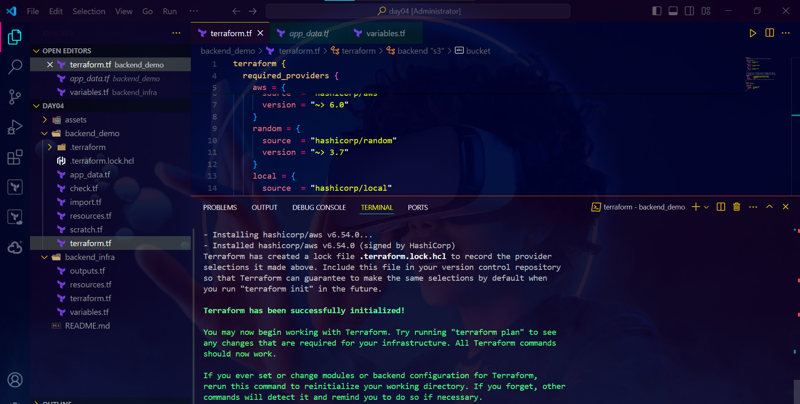

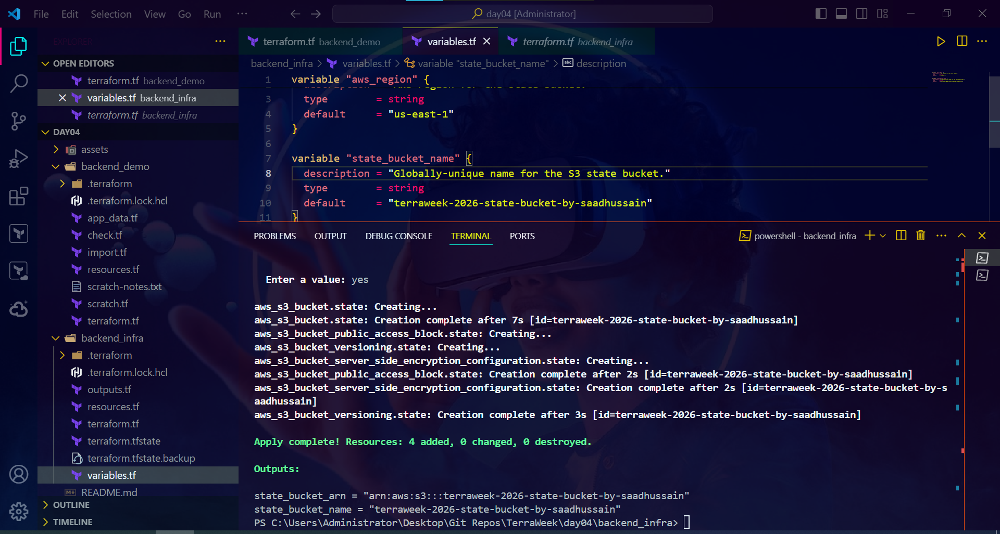

## 🔐 Task 4 — remote backend with native locking

```hcl
backend "s3" {
  bucket       = "terraweek-2026-state-bucket-by-saadhussain"
  key          = "day04/backend_demo/terraform.tfstate"
  region       = "us-east-1"
  encrypt      = true
  use_lockfile = true
}
```

Ran `terraform init` again after uncommenting the backend block — Terraform detected the local state and offered to migrate it:

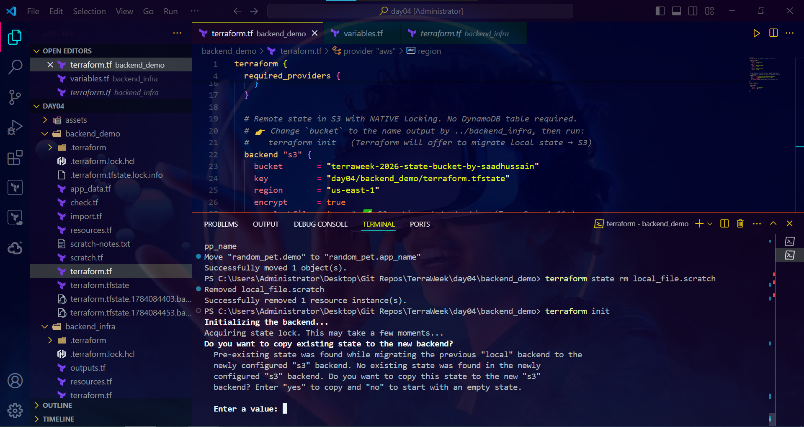

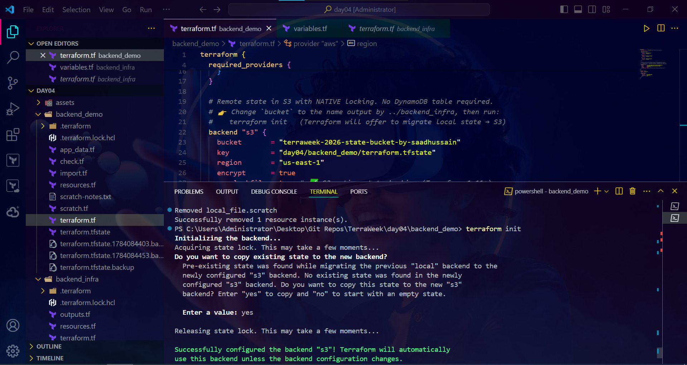

Confirmed in the S3 console that the state file landed at the expected key:

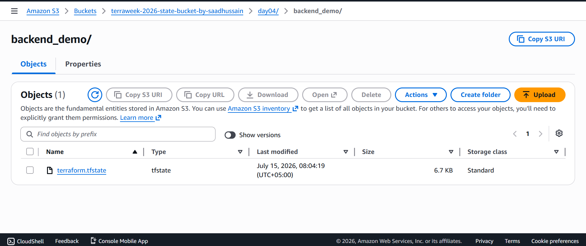

Then applied again against the now-remote state:

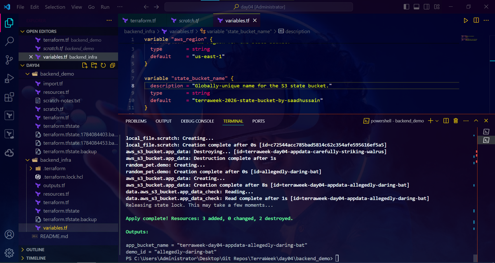

## 🍫 Bonus — `check` block

Added a continuous, non-blocking assertion confirming the app_data bucket exists and has a non-empty id:

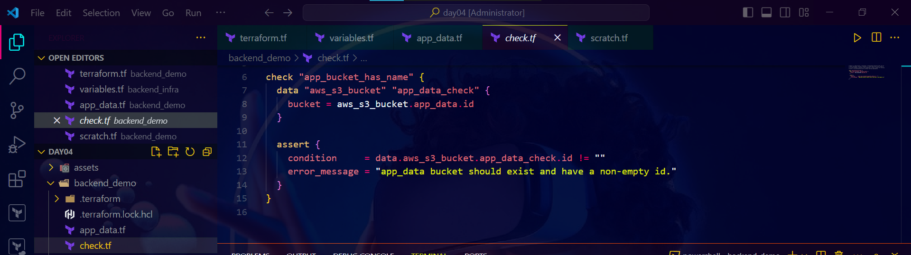

Unlike a resource, a `check` never halts a run on failure — it surfaces a warning ⚠️, which makes it useful for catching drift or misconfiguration without blocking deployments.

## 🍫 Bonus — `removed` block

After `terraform state rm local_file.scratch` (Task 2), replaced its resource block with a `removed` block (`destroy = false`) so Terraform permanently stops tracking the file while leaving it on disk:

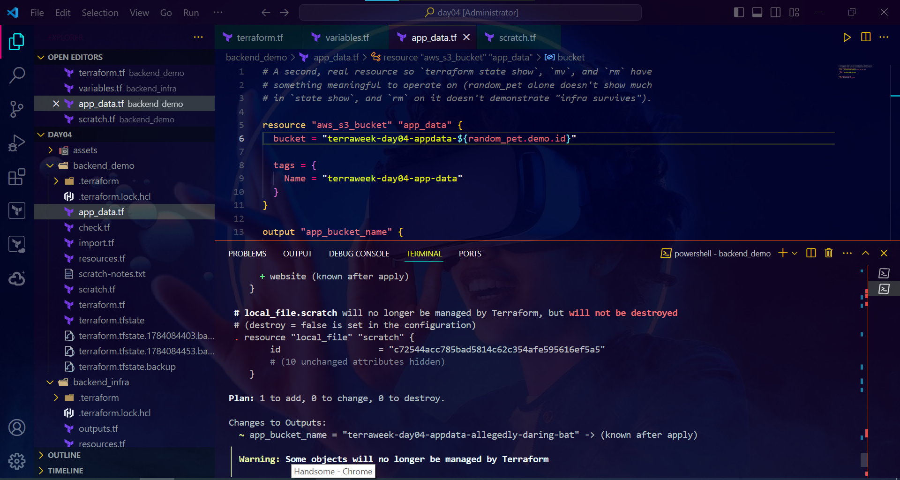

## 📥 Task 5 — importing an existing resource

Manually created an S3 bucket in the console (`terra-week-bucket-for-import`), then wrote the import block:

```hcl
import {
  to = aws_s3_bucket.imported
  id = "terra-week-bucket-for-import"
}
```

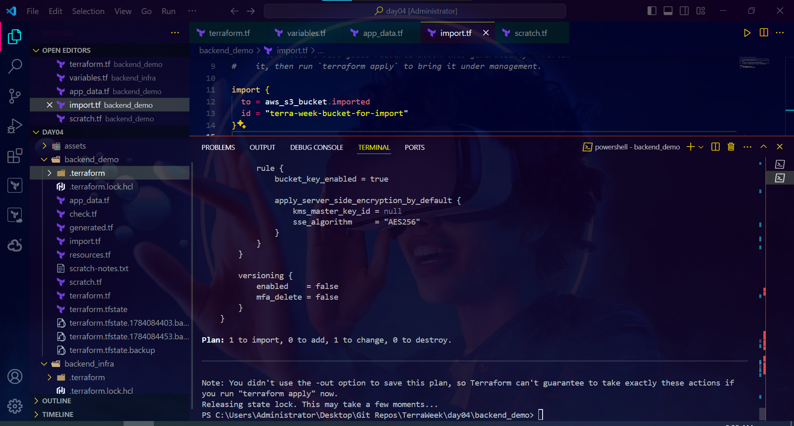

Generated the matching resource config instead of writing it by hand:

```
terraform plan -generate-config-out=generated.tf
```

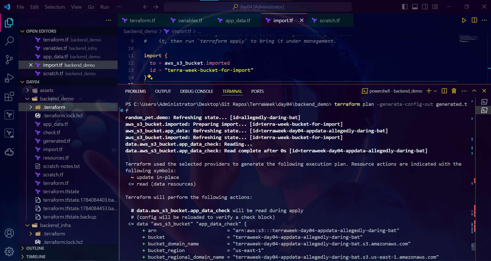

Reviewed `generated.tf`, then applied to bring it fully under management:

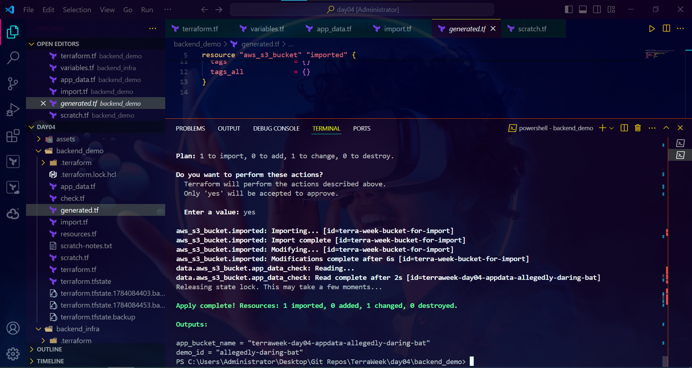

## 🧹 Cleanup

Destroyed `backend_demo` first, then `backend_infra` (which tears down the state bucket itself, now that nothing depends on it anymore):

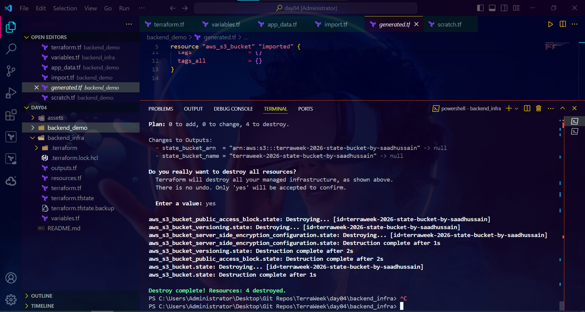

## 🍫 Bonus — comparing remote backends

| Backend | Notes |
|---|---|
| **S3** ☁️ | Cheapest, most common for AWS-only setups. Native locking since Terraform 1.11 means no DynamoDB table is needed anymore. |
| **HCP Terraform (Terraform Cloud)** 🌐 | Fully managed — built-in locking, a run history UI, and team access controls out of the box. Free tier has usage limits. |
| **Azure Storage** 🔷 | Azure's equivalent of the S3 backend — blob storage with native state locking support. |
| **GCS** 🟡 | Google Cloud's equivalent, similar feature set to S3. |

---
🏷️ #TrainWithShubham #TerraWeekChallenge