# ♻️ TerraWeek Day 5 — Modules: Reusable, Composable Infrastructure

📅 Date: Thursday, 16th July 2026

## 📝 Task 1 — Modules, the why

**What is a module? What's the root module?** A module is just a folder of `.tf` files — inputs in, resources managed, outputs out. The **root module** is wherever you run `terraform apply` from (here, `day05/example/`); anything it calls (`./modules/ec2_instance`, or a registry module) is a **child module**.

**Benefits:**
- 🔁 **Reusability** — write the EC2-launching logic once, call it for `web`, `app`, `worker`, `cache` without repeating a single resource block.
- 🎯 **Consistency** — every instance gets the same tagging scheme automatically.
- 📦 **Encapsulation** — callers only see inputs/outputs, not the resource internals.
- 🔒 **Versioning** — pin a module to a specific version/tag, upgrade deliberately.
- 🧪 **Testing** — a small, self-contained module is far easier to validate in isolation.

**Well-structured module files:** `main.tf` (resources), `variables.tf` (inputs + validation), `outputs.tf` (exports), `README.md` (usage docs) — all present in `modules/ec2_instance/`.

## 🧱 Task 2 — writing and testing the module

```bash
cd example
terraform init
```
Init output confirms Terraform pulling in the local module (`- servers in modules\ec2_instance`).

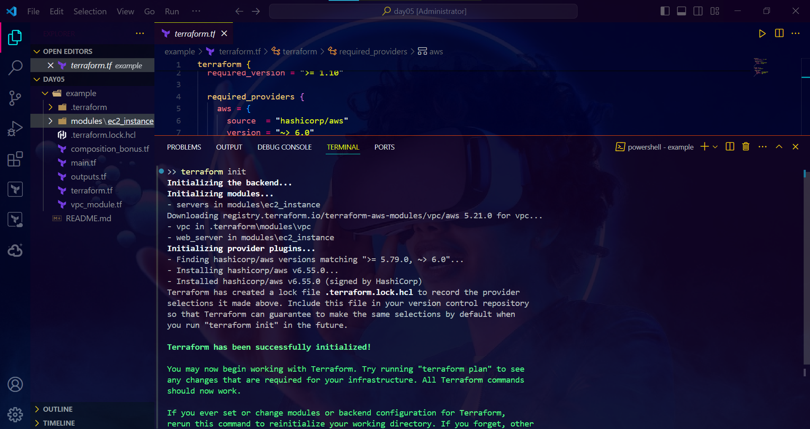

```bash
terraform plan
terraform apply
```

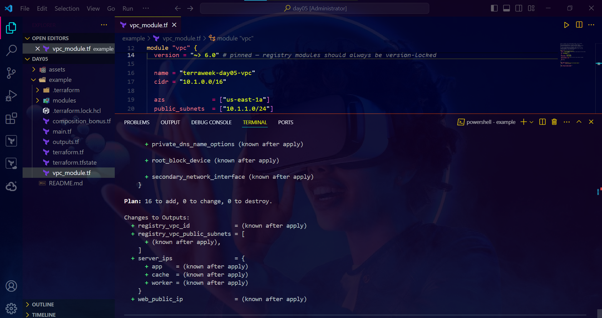
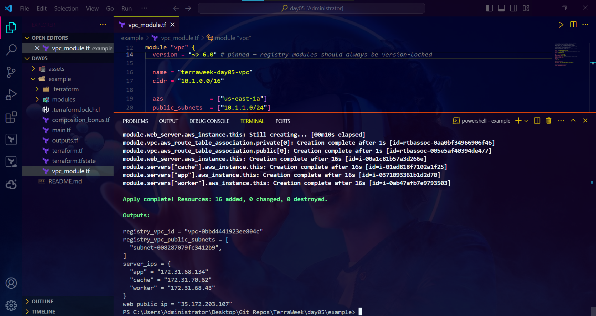

## 🧩 Task 3 — modular composition with `for_each`

The same `ec2_instance` module, instantiated three times (`app`, `worker`, `cache`) from a single block using `for_each = toset([...])` — each instance keeps a stable identity keyed by name, unlike `count`.

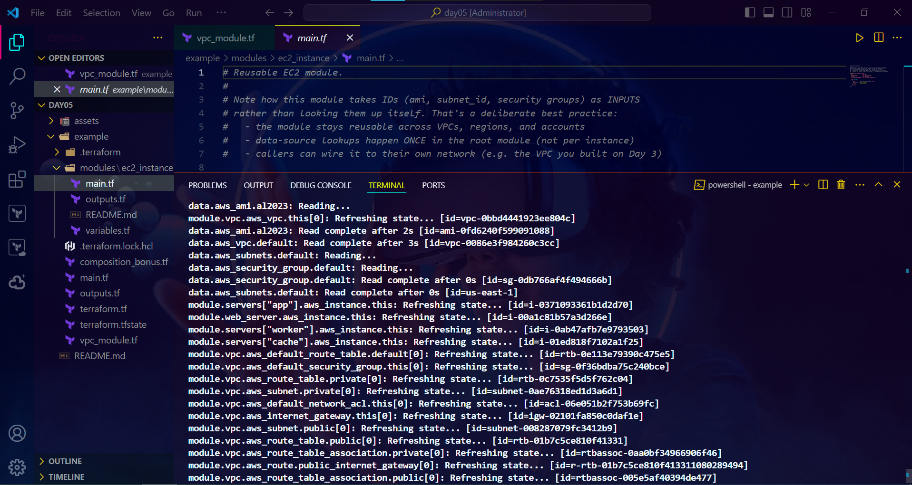

Confirmed live in the AWS Console — 4 instances total (1 `web_server` + 3 `for_each` servers), all `t3.micro`:

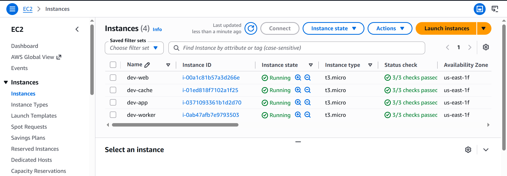

```bash
terraform output server_ips
```

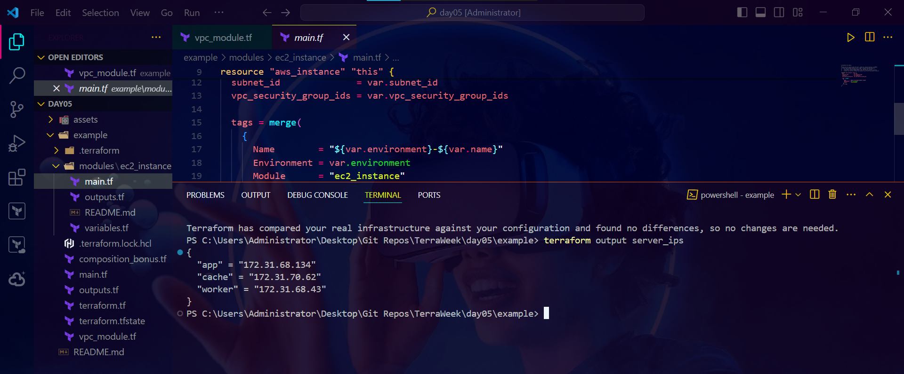

## 🌐 Task 4 — consuming a registry module, version-pinned

Used the official `terraform-aws-modules/vpc/aws` module from the Terraform Registry, pinned to `~> 6.0`, with `enable_nat_gateway = false` to stay free-tier friendly (NAT gateways aren't free and bill hourly):

```hcl
module "vpc" {
  source  = "terraform-aws-modules/vpc/aws"
  version = "~> 6.0" # pinned — registry modules should always be version-locked
  ...
}
```

Confirmed in the AWS Console:

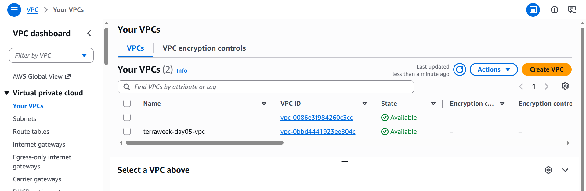

```bash
terraform output registry_vpc_id
terraform output registry_vpc_public_subnets
```

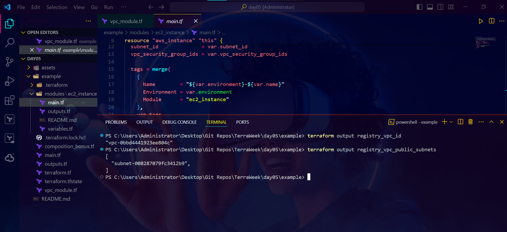

## 🔐 Task 5 — ways to lock module versions

| Method | Example |
|---|---|
| Registry version constraint | `version = "~> 5.0"` (also `= 5.1.2`, `>= 5.0, < 6.0`) |
| Git tag/ref | `source = "git::https://github.com/org/repo.git//path?ref=v1.2.0"` |
| Git commit SHA | `source = "git::https://github.com/org/repo.git//path?ref=<full-sha>"` |

**Why pinning matters:** ⚠️ without it, `terraform init` can silently pull a newer module version with breaking changes on any future run. Pinning to an exact version, tag, or commit SHA guarantees the build stays reproducible no matter when or where it's applied.

## 🎁 Bonus — README + input validation

`modules/ec2_instance/README.md` documents usage, inputs, and outputs in full. `variables.tf` includes real validation — `ami` must start with `ami-`, `environment` must be one of `dev`/`staging`/`prod`.

## 🎁 Bonus — publishing the module to GitHub + consuming via `git::`

Published `modules/ec2_instance` to its own repo, tagged `v1.0.0`, and switched `web_server`'s source to consume it over Git instead of the local path:

```hcl
module "web_server" {
  source = "git::https://github.com/saadhussain07/terraform-ec2-module.git?ref=v1.0.0"
  ...
}
```

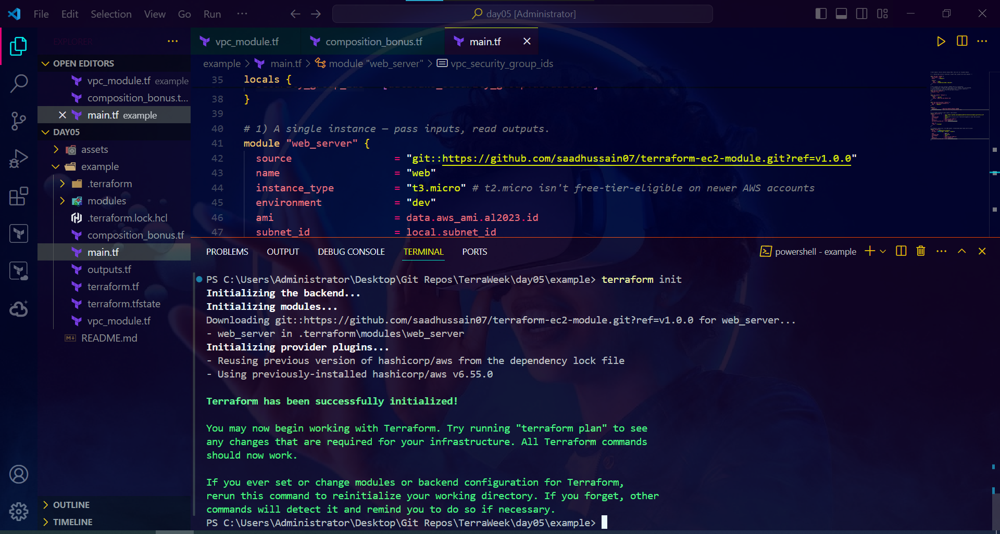

`terraform init` confirmed it downloading straight from the tagged Git ref.

## 🎁 Bonus — module composition (one module's output → another's input)

Wired the registry VPC module's public subnet directly into a new `ec2_instance` module call — proving outputs from one module can feed straight into another:

```hcl
module "vpc_demo_server" {
  source    = "./modules/ec2_instance"
  subnet_id = module.vpc.public_subnets[0]
  ...
}
```

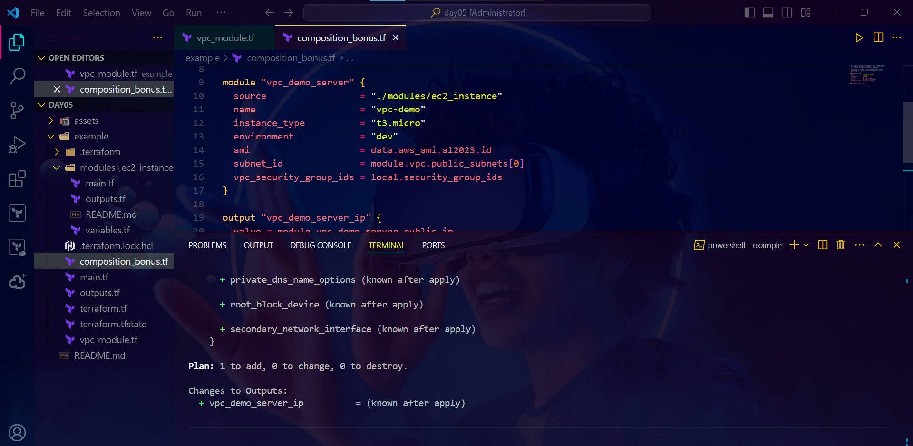

## 🧹 Cleanup

```bash
terraform destroy
```

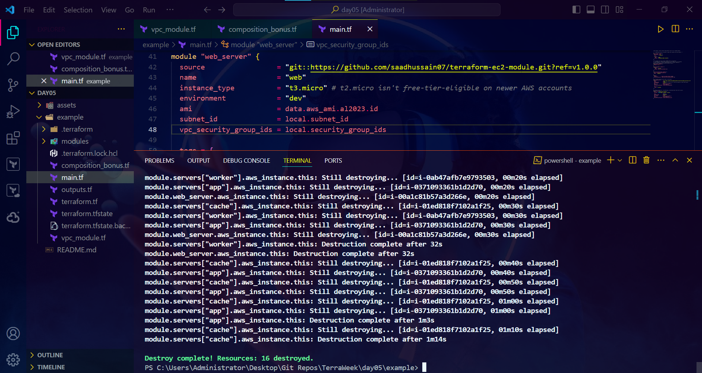

---
🏷️ #TrainWithShubham #TerraWeekChallenge
