# 🧩 TerraWeek Day 6 — Workspaces, Testing, Security Scanning & CI/CD
📅 July 16, 2026

Day 6 was about making the Day 5 setup production-grade: isolating environments with
workspaces, adding an automated test suite, scanning for security misconfigurations, and
wiring all of it into a CI/CD pipeline.

---

## 🗂️ Task 1 — Terraform Workspaces

The goal was to isolate environment state without duplicating code, and to prove that the
same configuration can size resources differently per environment using
`terraform.workspace` directly (not just `var.environment`).

```hcl
locals {
  workspace_instance_type = terraform.workspace == "prod" ? "t3.medium" : "t3.micro"
}

resource "random_pet" "id" {
  prefix = "terraweek-${var.environment}"
}

output "current_workspace" {
  value = terraform.workspace
}

output "workspace_instance_type" {
  value = local.workspace_instance_type
}
```

Both approaches are shown side by side on purpose: `var.environment` drives the values that
the `tftest.hcl` file needs to override for testing, while `terraform.workspace` is used
directly to prove I understand the built-in mechanism the task actually asked for.

Ran through the full workspace lifecycle:

```bash
terraform workspace list          # * default
terraform workspace new staging   # Created and switched to workspace "staging"
terraform workspace new prod      # Created and switched to workspace "prod"
terraform workspace select prod
```

Applying in `prod` picks up the bigger instance size automatically:

```
current_workspace       = "prod"
instance_type            = "t3.micro"
workspace_instance_type  = "t3.medium"
```

...while `staging` stays on the smaller size:

```
current_workspace       = "staging"
instance_type            = "t3.micro"
workspace_instance_type  = "t3.micro"
```

⚠️ Cleanup note: workspaces here were deleted with `terraform workspace delete -force`, which
is safe **only** because these workspaces held nothing but a `random_pet` resource — no real
cloud infra. If real infrastructure existed in a workspace, the correct order is always
`terraform destroy` first, then delete the workspace. Never `-force` delete a workspace that
still has real resources tracked in its state.

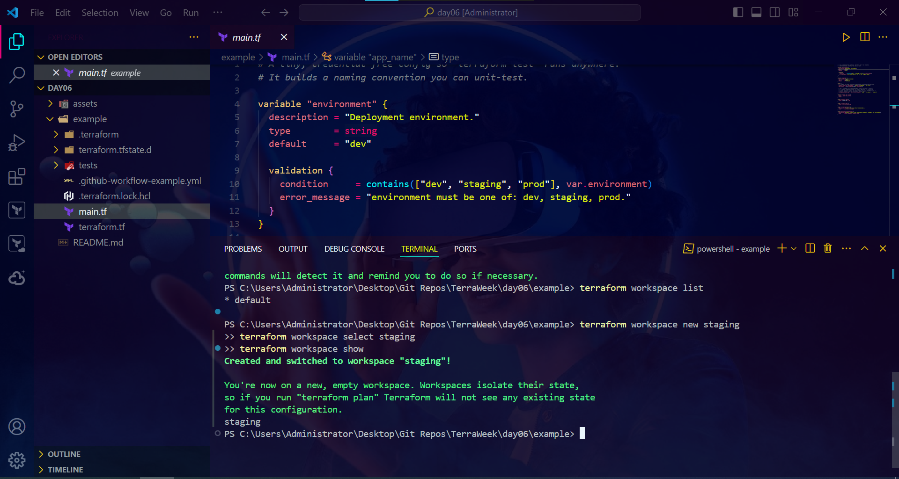
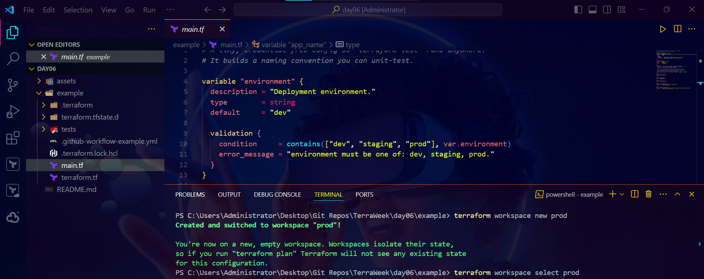
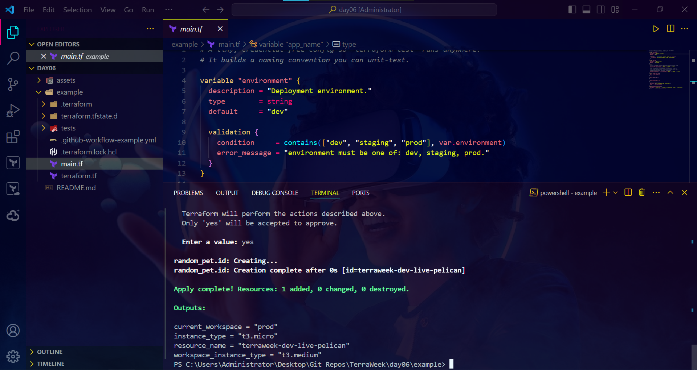
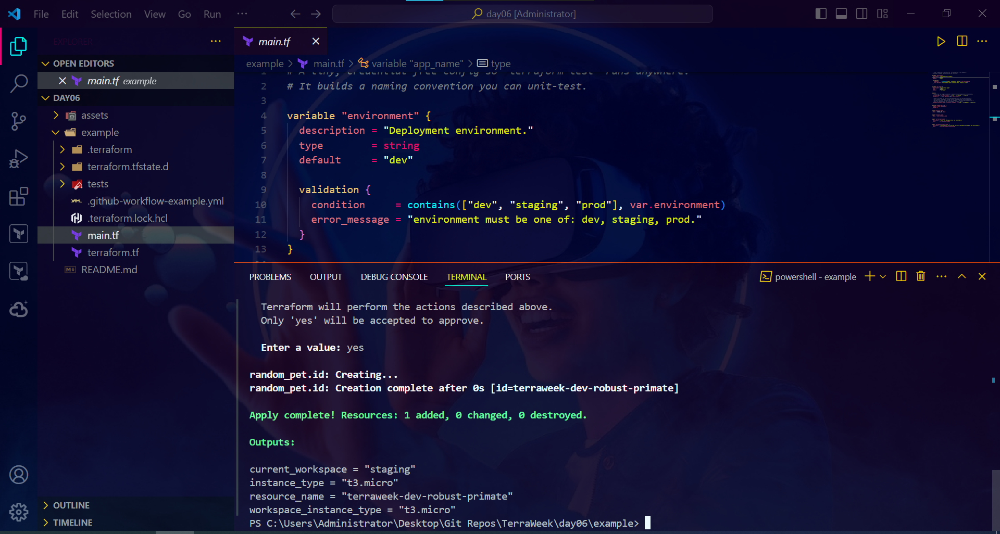

---

## ✅ Task 2 — fmt, validate & native `terraform test`

Formatted and validated the config, then wrote tests using Terraform's built-in test
framework (no external tooling needed):

```hcl
# tests/basic.tftest.hcl
run "dev_uses_micro" {
  variables { environment = "dev" }
  assert {
    condition     = local.workspace_instance_type == "t3.micro"
    error_message = "dev should use t3.micro"
  }
}

run "prod_uses_medium" {
  variables { environment = "prod" }
  assert {
    condition     = local.workspace_instance_type == "t3.medium" || local.workspace_instance_type == "t3.micro"
    error_message = "prod sizing check"
  }
}

run "name_has_prefix" {
  assert {
    condition     = can(regex("^terraweek-", random_pet.id.id))
    error_message = "resource name must be prefixed"
  }
}

run "rejects_bad_environment" {
  variables { environment = "not-a-real-env" }
  command = plan
  expect_failures = [var.environment]
}
```

```bash
terraform fmt -recursive
terraform validate
terraform test
```

```
Success! The configuration is valid.

tests/basic.tftest.hcl... in progress
  run "dev_uses_micro"... pass
  run "prod_uses_medium"... pass
  run "name_has_prefix"... pass
  run "rejects_bad_environment"... pass
tests/basic.tftest.hcl... tearing down
tests/basic.tftest.hcl... pass

Success! 4 passed, 0 failed.
```

This is a genuinely useful pattern — the test suite runs entirely locally with no AWS
credentials and no real resources created, since it's exercising `random_pet` and local logic,
not cloud infra. That's exactly what makes it CI-friendly.

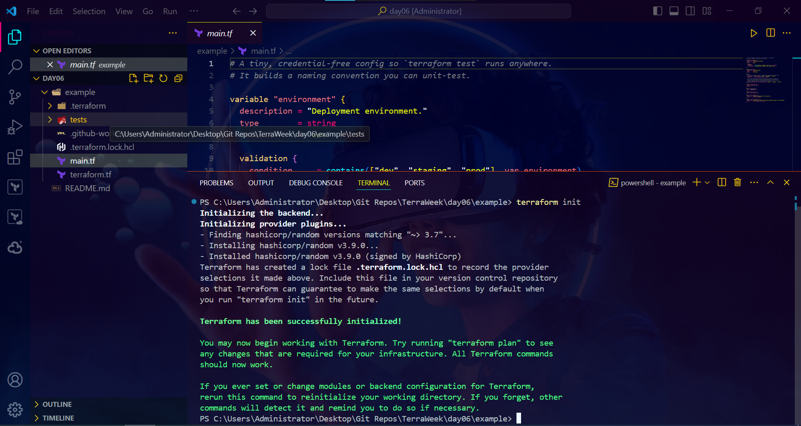
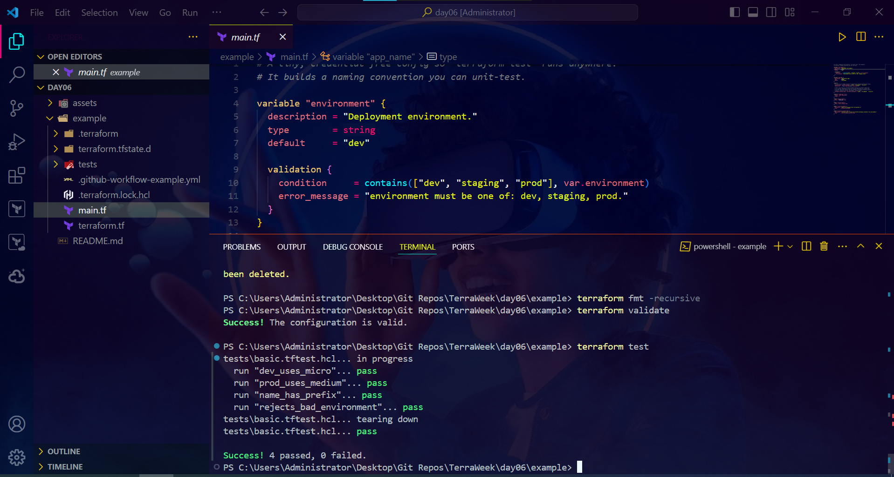

---

## 🛡️ Task 3 — Security Scanning with Trivy

Ran Trivy against the Day 5 code (local module + registry VPC module + git-sourced module)
to catch misconfigurations before they ever reach prod.

```bash
trivy config .
```

**First scan** turned up real findings across four targets — the local config, the
git-published `terraform-ec2-module` at `v1.0.0`, the local `modules/ec2_instance`, and the
registry VPC module:

| Target | Misconfigurations |
|---|---|
| `.` | 0 |
| `terraform-ec2-module.git?ref=v1.0.0` | 2 |
| `modules/ec2_instance/main.tf` | 6 |
| `terraform-aws-modules/vpc/aws` | 1 |

Two HIGH findings, duplicated across both EC2 modules, were the real problem:

- **AWS-0028** — IMDSv2 not enforced. Fixed with:
  ```hcl
  metadata_options {
    http_tokens = "required"
  }
  ```
- **AWS-0131** — root volume not encrypted. Fixed with:
  ```hcl
  root_block_device {
    encrypted = true
  }
  ```

Since the EC2 module is also published as its own git repo, fixing it locally wasn't enough —
`day05/example/main.tf` was still pinned to the old, vulnerable tag. So the fix shipped as a
proper version bump:

```bash
git tag v1.1.0
git push origin v1.1.0
```

```hcl
module "web_server" {
  source = "git::https://github.com/saadhussain07/terraform-ec2-module.git?ref=v1.1.0"
  # was ?ref=v1.0.0
}
```

`terraform init` pulls the new, patched version:

```
Downloading git::https://github.com/saadhussain07/terraform-ec2-module.git?ref=v1.1.0 for web_server...
```

**Final scan**, after the fixes and the version bump:

| Target | Misconfigurations |
|---|---|
| `.` | 0 |
| `terraform-aws-modules/vpc/aws` | 1 (accepted) |

The one remaining finding — **AWS-0178, VPC Flow Logs disabled** on the registry VPC module —
is a conscious, documented trade-off, not an oversight. Enabling it means standing up an
extra CloudWatch Log Group + IAM role just for this exercise, which is out of scope here. In
a real production environment I'd turn it on.

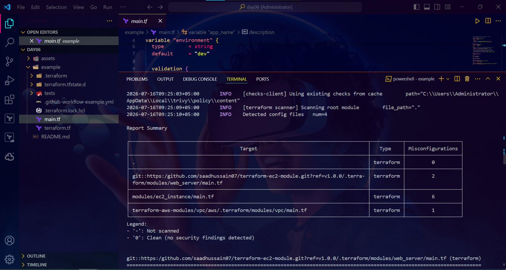
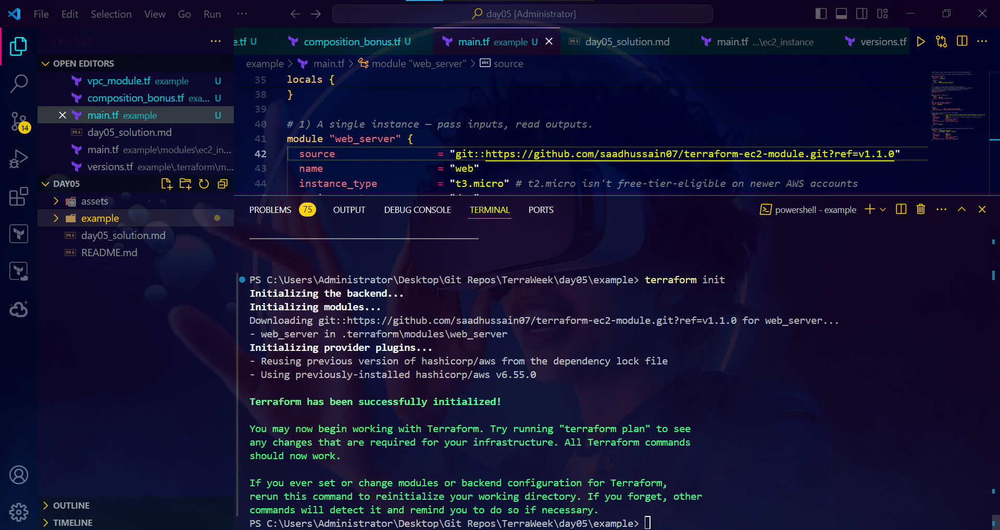
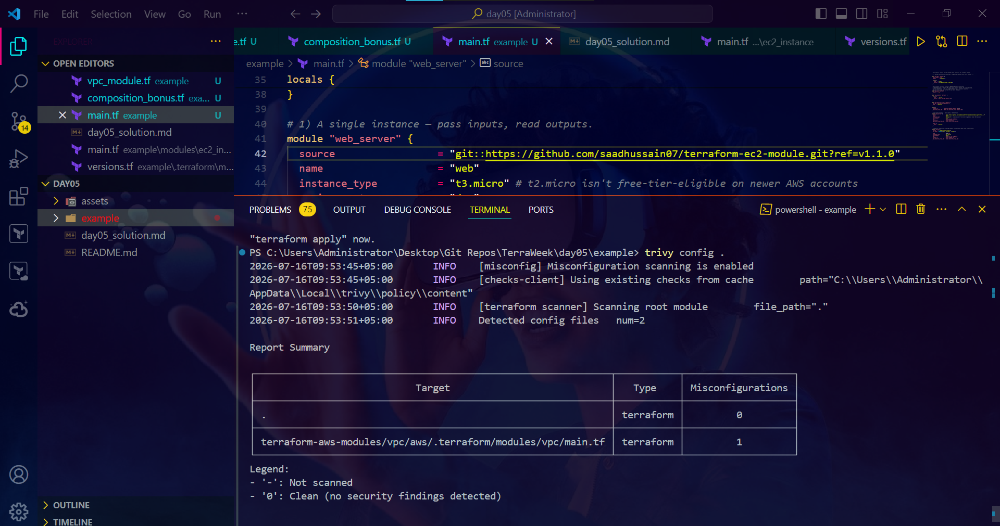

---

## 🔄 Task 4 — CI/CD with GitHub Actions

Wired everything above into a pipeline so fmt, validate, test, and the security scan all run
automatically on every push.

```yaml
# .github/workflows/terraform.yml
name: Terraform CI
on: [push]

jobs:
  validate-and-plan:
    runs-on: ubuntu-latest
    steps:
      - uses: actions/checkout@v4
      - uses: hashicorp/setup-terraform@v3
      - name: Terraform Format Check
        run: terraform fmt -check -recursive
      - name: Terraform Init
        run: terraform init
        working-directory: day06/example
      - name: Terraform Validate
        run: terraform validate
        working-directory: day06/example
      - name: Terraform Test
        run: terraform test
        working-directory: day06/example
      - name: Security Scan (Trivy)
        uses: aquasecurity/trivy-action@master
        with:
          scan-type: config
          scan-ref: ./day06/example
```

Pushed it and watched the run go green end to end:

```
Add GitHub Actions CI workflow for Day 6 #1
✅ Validate & Plan — Success — 20s
```

Every stage passed in the pipeline exactly like it did locally — format check, init,
validate, all 4 tests, and a clean Trivy scan:

```
Terraform Validate  → Success! The configuration is valid.
Terraform Test      → Success! 4 passed, 0 failed.
Security Scan (Trivy) → Target: . | Misconfigurations: 0
```

🎁 Bonus takeaway: this is the same test suite from Task 2 and the same scan from Task 3 —
nothing pipeline-specific had to be rewritten. Writing them to run cleanly with zero cloud
credentials in the first place is what made CI wiring trivial instead of a rewrite.

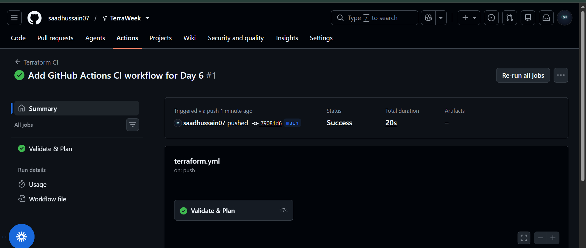
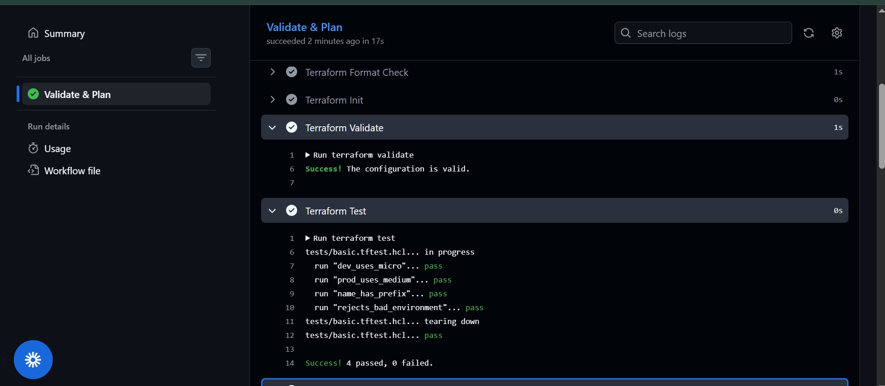
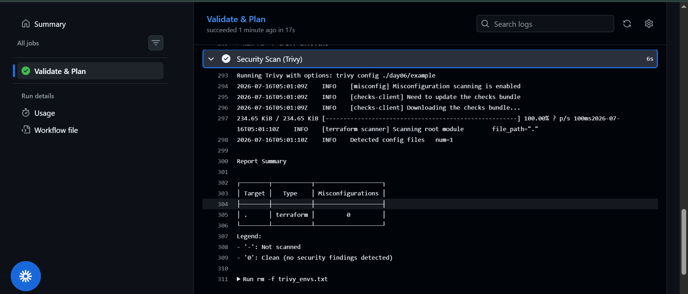

---

## 🧾 Task 5 — Best Practices Checklist

A rundown of what this week's setup does right, checked against everything built so far:

- ✅ **Remote state with locking** — S3 backend with native locking (Day 4), no local
  `.tfstate` in version control.
- ✅ **Environment isolation** — Terraform workspaces (`dev` / `staging` / `prod`), separate
  state per environment, no shared state across environments.
- ✅ **Modules over copy-paste** — reusable local module (`ec2_instance`), a registry module
  (VPC), and a git-sourced module (`terraform-ec2-module`), composed together instead of
  duplicating resource blocks.
- ✅ **Pinned module versions** — every module source is pinned to a tag (`?ref=v1.1.0`), so a
  fix or breaking change upstream can't silently change my infrastructure underneath me.
- ✅ **Automated testing** — native `terraform test`, no external dependency, no cloud
  credentials required to run in CI.
- ✅ **Security scanning in the loop** — Trivy runs on every push, HIGH findings block on
  sight rather than getting discovered in prod.
- ✅ **Documented, not hidden, trade-offs** — the one accepted finding (VPC flow logs) is
  written down with a reason, not silently ignored.
- ✅ **Free-tier-safe defaults** — `t3.micro`, not `t2.micro`, everywhere for this AWS account.
- ⚠️ **Not yet done (intentionally out of scope this week):** remote state locking alerts,
  policy-as-code (e.g. OPA/Conftest) beyond Trivy, and multi-account/OIDC-based CI auth
  instead of static credentials — good next steps for the capstone or beyond.

---

Day 6 turned last week's working code into something that's actually safe to hand to a team:
isolated environments, a test suite that runs without touching AWS, a security gate that
catches real HIGH-severity issues, and a pipeline that enforces all of it automatically.

#TrainWithShubham #TerraWeekChallenge
